# Materials checklist

2026-09-19 · installation audit. **✓ 5 owned groups · □ 31 groups to buy or fabricate**

One 120 V L/N/PE printer enclosure. User confirmed only the five checked equipment groups are on hand; all other enclosure materials are to buy or fabricate. Quantities are per assembly, not vendor pack quantities. Purchase candidates are not a released construction BOM; no orders placed.

**Inventory basis:** User confirmation on 2026-09-19: ELITEpro XC, existing CTs, three blue voltage pigtails, matching long voltage leads, and the original black two-pin AC/DC adapter only. USB cable and all other enclosure materials are not on hand.

A check means on hand, not electrically approved. Counts refer to material groups, not individual pieces. Needed quantities and vendor pack sizes differ. The USB data cable is **to buy**, as confirmed by the user.

Buy links go to specific products; Select / Configure links need a size or rating first; Quote / Fabrication links require a supplier quote or a final custom drawing. Check current stock, minimum orders and lead times with each supplier. No orders have been placed.

Photos identify the equipment or candidate part. Family examples and unfinished custom parts are labeled. Images are not at a common scale; use the dimension schedule and 3D layout for size comparisons. Click an image to view the original. Image sources are credited below each picture.

## ✓ Equipment on hand

| Inventory | Item | Quantity needed | Part and purpose | Purchase / source | Remaining checks |
|---|---|---|---|---|---|
| ✓ Owned | Power logger<figure class="material-photo" data-image-kind="user"><a class="material-image" href="assets/materials/meter.jpg" target="_blank" rel="noopener" aria-label="View full image: Power logger"></a><figcaption>Your equipment · supplied photo</figcaption></figure> | 1 | **DENT ELITEpro XC** — Reuse the photographed instrument. The model uses the published 216 × 63 × 47 mm body; measure this unit before making its cradle. | Reuse · No purchase needed | On hand · confirmed by user and photos; dimensions still to measure |
| ✓ Owned | Current sensor<figure class="material-photo" data-image-kind="user"><a class="material-image" href="assets/materials/ct.jpg" target="_blank" rel="noopener" aria-label="View full image: Current sensor"></a><figcaption>Your equipment · supplied photo</figcaption></figure> | 1 required; existing set available | **Existing DENT split-core CT** — Reuse one compatible sensor on printer hot only. Read its actual model, current range and output before setting CH1 in ELOG; the photo does not establish these ratings. | Reuse · No purchase needed | On hand · compatibility and exact model still to verify |
| ✓ Owned | Blue voltage pigtails<figure class="material-photo" data-image-kind="user"><a class="material-image" href="assets/materials/blue-leads.jpg" target="_blank" rel="noopener" aria-label="View full image: Blue voltage pigtails"></a><figcaption>Your equipment · supplied photo</figcaption></figure> | 3 | **Existing detachable blue pigtails** — A1 is the hot voltage tap to L1; A2 and A3 are neutral voltage taps to L2 and N. These are sensing leads, not the printer power conductors or protective earth. | Reuse · No purchase needed | On hand · user confirmed three; lead ratings and termination acceptance pending |
| ✓ Owned | Full voltage leads<figure class="material-photo" data-image-kind="user"><a class="material-image" href="assets/materials/voltage-leads.jpg" target="_blank" rel="noopener" aria-label="View full image: Full voltage leads"></a><figcaption>Your equipment · supplied photo</figcaption></figure> | 1 set; 3 leads used | **Existing matching voltage lead set** — Mate with the three blue pigtails and retain the full factory leads. Check connector compatibility, insulation and bend allowance. | Reuse · No purchase needed | On hand · confirmed by user; no replacement set planned |
| ✓ Owned | AC/DC adapter<figure class="material-photo" data-image-kind="user"><a class="material-image" href="assets/materials/adapter.jpg" target="_blank" rel="noopener" aria-label="View full image: AC/DC adapter"></a><figcaption>Your equipment · supplied photo</figcaption></figure> | 1 with original barrel cable | **Existing two-pin AC/DC adapter** — Plug into XA outside the enclosure. Keep the original DC cable intact. Verify the adapter label against the meter input: 6–10 V DC, 500 mA, center positive. | Reuse · No purchase needed | On hand · user confirmed this is the plug to use; output rating still to verify |

## □ Purchase and fabrication list

| Inventory | Item | Quantity needed | Part and purpose | Purchase / source | Remaining checks |
|---|---|---|---|---|---|
| □ To buy | Enclosure<figure class="material-photo" data-image-kind="product"><figcaption>Product image<a href="https://www.solutionsdirectonline.com/hammond-16x14x8-polycarbonate-electrical-enclosure-with-clear-cover-pcj16148cc">Image: Solutions Direct ↗</a></figcaption></figure> | 1 | **Hammond PCJ16148CC** — Gray polycarbonate body with a clear lift-off lid. Selected for connector clearance and lead storage around the long meter. Nominal 16 × 14 × 8 in; use the manufacturer drawing/CAD for real outside dimensions. | [Buy · Solutions Direct](https://www.solutionsdirectonline.com/hammond-16x14x8-polycarbonate-electrical-enclosure-with-clear-cover-pcj16148cc) [Hammond drawing](https://www.hammfg.com/files/parts/pdf/PCJ16148CC.pdf) | Panel compatible; nominal insertion checked. Wall openings / hardware and physical dry fit remain unresolved. |
| □ To buy | Mounting panel<figure class="material-photo" data-image-kind="product"><figcaption>Product image<a href="https://www.hammfg.com/part/14R1513">Image: Hammond ↗</a></figcaption></figure> | 1 | **Hammond 14R1513** — Steel panel, approximately 327 × 374.7 × 1.9 mm. Ordered separately from the box. Provide its own PE bond; do not depend on painted mounting screws. | [Buy · DigiKey](https://www.digikey.com/en/products/detail/hammond-manufacturing/14R1513/2359585) [Hammond](https://www.hammfg.com/part/14R1513) | Matches selected enclosure |
| □ To buy | Q0 operating breaker<figure class="material-photo" data-image-kind="reference"><figcaption>C-series reference image from the selected part listing.<a href="https://www.mouser.kr/ProductDetail/Carling-Technologies/CA1-B0-24-615-121-DG?qs=vln4JGBFwFoweMB2W4WfRg%3D%3D">Image: Mouser ↗</a></figcaption></figure> | 1 | **Carling CA1-B0-24-615-121-DG** — Panel-mounted, one-pole 15 A candidate with exterior handle. Manufacturer ordering code specifies 50/60 Hz medium delay, stud terminals and the 240 VAC UL 489 / CSA option. Confirm exact suffix, branch-circuit suitability, supply fault level, combined printer + logger load, inrush and switching duty. Do not substitute a DC-only or UL 1077 variant. | [Quote · Mouser listing](https://www.mouser.kr/ProductDetail/Carling-Technologies/CA1-B0-24-615-121-DG?qs=vln4JGBFwFoweMB2W4WfRg%3D%3D) [Carling specification](https://www.carlingtech.com/sites/default/files/documents/C-Series_datasheet.pdf) | Confirm electrical selection; request price / lead time |
| □ To buy | XA adapter receptacle<figure class="material-photo" data-image-kind="reference"><figcaption>5261 shown in brown; the linked 5261-W is white.<a href="https://leviton.com/products/5261">Image: Leviton ↗</a></figcaption></figure> | 1 | **Leviton 5261 / 5261-W** — One NEMA 5-15R, 15 A / 125 V receptacle. Existing black two-pin adapter plugs in outside the right wall. Rear terminations stay in the bonded device box. Label ELITEpro ADAPTER ONLY · UNMETERED. | [Buy · RS](https://us.rs-online.com/product/leviton/5261-w/71692784/) [Leviton](https://leviton.com/products/5261) | Confirm adapter clearance and mounting stack |
| □ To buy | XA rear device box<figure class="material-photo" data-image-kind="product"><a class="material-image" href="assets/materials/outlet-box.jpg" target="_blank" rel="noopener" aria-label="View full image: XA rear device box">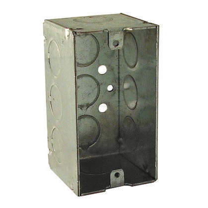</a><figcaption>Product image<a href="https://www.platt.com/p/0052365/hubbell-raco/handy-box-2-1-8-deep-1-2-kos-welded-metallic/050169906705/rac670rac">Image: Platt ↗</a></figcaption></figure> | 1 | **RACO 670RAC / retail 8670** — 4 × 2.125 × 2.188 in handy-box envelope, about 101.6 × 54 × 55.6 mm. Guards the rear of XA. Include a dedicated PE bond, listed knockout closure(s) and a suitable wire-entry fitting. Wall support remains a fabricated item. | [Buy · Platt](https://www.platt.com/p/0052365/hubbell-raco/handy-box-2-1-8-deep-1-2-kos-welded-metallic/050169906705/rac670rac) [RACO dimensions](https://hubbellcdn.com/specsheet/RACO-670RAC-SPEC-EN.pdf) | Confirm yoke / box / support fit |
| □ To buy | XA faceplate<figure class="material-photo" data-image-kind="product"><a class="material-image" href="assets/materials/faceplate.jpg" target="_blank" rel="noopener" aria-label="View full image: XA faceplate">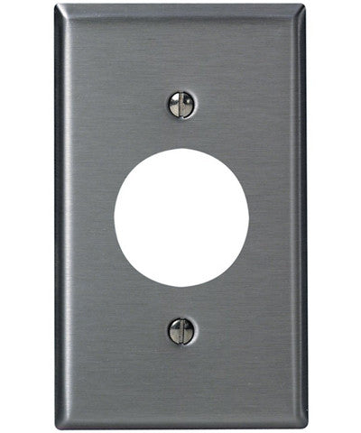</a><figcaption>Product image<a href="https://store.leviton.com/products/1-gang-single-1-406-inch-hole-device-receptacle-wall-plate-standard-size-device-mount-stainless-steel-84004-40">Image: Leviton ↗</a></figcaption></figure> | 1 | **Leviton 84004-40** — Single round 1.406 in opening; standard stainless wallplate, approximately 114.3 × 69.9 mm. Fits the single-receptacle concept. Bond accessible metalwork through the approved device/box arrangement. | [Buy · Leviton](https://store.leviton.com/products/1-gang-single-1-406-inch-hole-device-receptacle-wall-plate-standard-size-device-mount-stainless-steel-84004-40) [Leviton specification](https://leviton.com/products/84004-40) | Confirm complete stack before cutting wall |
| □ To buy | Fv fuse holder<figure class="material-photo" data-image-kind="product"><a class="material-image" href="assets/materials/fuse-holder.jpg" target="_blank" rel="noopener" aria-label="View full image: Fv fuse holder">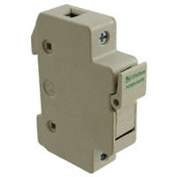</a><figcaption>Product image<a href="https://us.rs-online.com/product/bussmann-by-eaton/chcc1du/70150778/">Image: RS ↗</a></figcaption></figure> | 1 | **Eaton Bussmann CHCC1DU** — Single Class CC DIN fuse-holder candidate for the hot voltage tap before A1. Body approximately 17.5 × 73.9 × 83.2 mm. Holder rating does not specify the required fuse ampere rating. Confirm lead size and termination acceptance. | [Buy · DigiKey](https://www.digikey.com/en/products/detail/eaton-bussmann-electrical-division/CHCC1DU/2767773) [Bussmann catalog · p.145](https://www.eaton.com/content/dam/eaton/products/electrical-circuit-protection/bussmann-iec-low-voltage-fuses/eaton-bussmann-series-low-voltage-fuses-catalog-ca134002en-en-us.pdf) [Eaton technical data 10430](https://www.eaton.com/content/dam/eaton/products/electrical-circuit-protection/fuses/data-sheets/bus-ele-ds-10430-chcc-chm-chpv.pdf) [Eaton SKU page (conflicting data)](https://www.eaton.com/us/en-us/skuPage.CHCC1DU.html) | Hold purchase: Eaton SKU page and technical sheet disagree on dimensions / voltage. Obtain exact-revision confirmation; fuse value remains pending. |
| □ To buy | Fv fuse<figure class="material-photo" data-image-kind="reference"><a class="material-image" href="assets/materials/fuse.jpg" target="_blank" rel="noopener" aria-label="View full image: Fv fuse">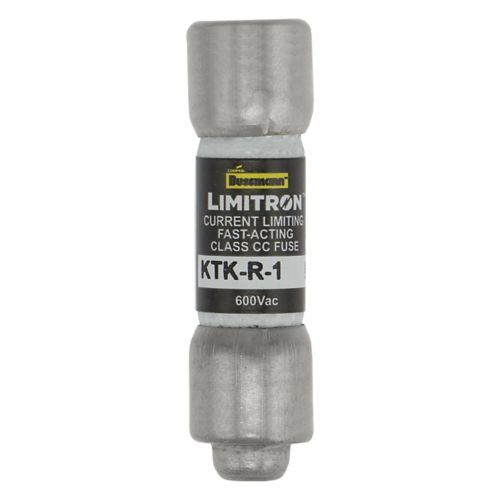</a><figcaption>Class CC example: KTK-R-1 shown. The project fuse rating is still pending.<a href="https://www.eaton.com/us/en-us/skuPage.KTK-R-1.html">Image: Eaton ↗</a></figcaption></figure> | 1 + spare | **Compatible Class CC fuse · value pending** — Select voltage, ampere, interrupting rating and time characteristic for the exact sensing leads and prospective fault current. KTK-R / FNQ-R / LP-CC are holder-compatible families in the catalog; no particular value has been approved. Fv is passive and adds no operating switch. | [Select rating / buy · Class CC fuses](https://www.mouser.com/c/circuit-protection/fuses/?fuse+size+%2F+group=Class+CC) [Compatible families / selection](https://www.eaton.com/content/dam/eaton/products/electrical-circuit-protection/bussmann-iec-low-voltage-fuses/eaton-bussmann-series-low-voltage-fuses-catalog-ca134002en-en-us.pdf) | Rating first · no fuse SKU or ampere value released for purchase |
| □ To buy | Distribution connectors<figure class="material-photo" data-image-kind="product"><figcaption>Product image<a href="https://www.digikey.com/en/products/detail/wago-corporation/221-415/13549457">Image: DigiKey ↗</a></figcaption></figure> | 4 | **WAGO 221-415** — One each for JL and JN; two bridged connectors for JPE and six external PE connections. Use only with permitted copper conductors, sizes and terminations; confirm tinned blue pigtail and protective-bonding suitability. All groups remain separate. | [Buy · DigiKey](https://www.digikey.com/en/products/detail/wago-corporation/221-415/13549457) [WAGO](https://www.wago.com/us/wire-splicing-connectors/compact-splicing-connector/p/221-415) | Confirm conductor / bonding acceptance |
| □ To buy | Connector carriers<figure class="material-photo" data-image-kind="reference"><figcaption>221-505 product image.<a href="https://www.digikey.com/en/products/detail/wago-corporation/221-505/15568477">Image: DigiKey ↗</a></figcaption></figure> | 4 | **WAGO 221-505** — Secure the connector groups to the backpanel using the carrier's permitted mounting method. 3D carrier envelope is provisional. Add guards as needed; loose connectors must not rely on the wire for support. | [Buy · DigiKey](https://www.digikey.com/en/products/detail/wago-corporation/221-505/15568477) [WAGO](https://www.wago.com/us/wire-splicing-connectors/mounting-carrier-221-series-24-12-awg/p/221-505) [WAGO carrier drawing](https://www1.futureelectronics.com/doc/WAGO/221-505.pdf) | Catalog fit confirmed for 221-415; use M3 or ST2.9 fixing per WAGO drawing, with final screw length to suit panel. |
| □ To buy | Short DIN rail<figure class="material-photo" data-image-kind="reference"><a class="material-image" href="assets/materials/din-rail.jpg" target="_blank" rel="noopener" aria-label="View full image: Short DIN rail">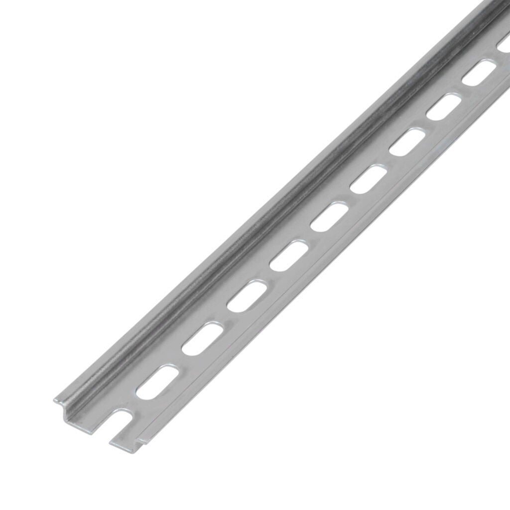</a><figcaption>35 × 7.5 mm rail shown before cutting to length.<a href="https://www.automationdirect.com/adc/shopping/catalog/wire_-a-_cable_management/din_rail/din_rail/dn-r35s1-2">Image: AutomationDirect ↗</a></figcaption></figure> | 100 mm cut length; buy 1 pack only if no suitable offcut | **DINnector DN-R35S1-2** — 35 × 7.5 mm steel profile for Fv only; the linked pack contains two 1 m lengths. End stops and fasteners are separate rows below. Deburr, secure and bond the rail. Q0 is panel mounted. | [Buy · AutomationDirect](https://www.automationdirect.com/adc/shopping/catalog/wire_-a-_cable_management/din_rail/din_rail/dn-r35s1-2) | Cut length to final fit; pack quantity exceeds one-box need |
| □ To buy | Mains / printer cord<figure class="material-photo" data-image-kind="product"><figcaption>Product image<a href="https://www.homedepot.com/p/Southwire-By-the-Foot-14-3-300-Volt-CU-Black-Flexible-Portable-Power-SJOOW-Cord-55808699/204633006">Image: Home Depot ↗</a></figcaption></figure> | Length after routing | **Southwire 55808699 · 14/3 SJOOW** — Candidate 3-conductor flexible cord for input and printer output. Catalog nominal OD is about 9.17 mm; measure actual cord and choose fittings accordingly. Final current rating depends on the complete assembly and use conditions. | [Buy · Home Depot](https://www.homedepot.com/p/Southwire-By-the-Foot-14-3-300-Volt-CU-Black-Flexible-Portable-Power-SJOOW-Cord-55808699/204633006) | Confirm load, length and actual OD |
| □ To buy | Supply plug<figure class="material-photo" data-image-kind="product"><figcaption>Product image<a href="https://leviton.com/products/515pv">Image: Leviton ↗</a></figcaption></figure> | 1 | **Leviton 515PV · NEMA 5-15P** — Grounded 15 A / 125 V male supply plug for the 14/3 input cord. Check accepted wire size and jacket OD against the chosen cord. | [Buy plug · Home Depot](https://www.homedepot.com/p/Leviton-15-Amp-125-Volt-3-Wire-Plug-Yellow-515PV-YL-R10-515PV-0YL/309610976) [Leviton cord instructions](https://leviton.com/content/dam/leviton/residential/product_documents/instruction_sheet/515_Instruction_Sheet.pdf) | Confirm cord acceptance before ordering |
| □ To buy | Printer output connector<figure class="material-photo" data-image-kind="product"><figcaption>Product image<a href="https://leviton.com/products/515cv">Image: Leviton ↗</a></figcaption></figure> | 1 | **Leviton 515CV · NEMA 5-15R** — Grounded female cord connector for the measured printer output. The printer connects here; XA is reserved for the meter adapter. | [Buy connector · SupplyHouse](https://www.supplyhouse.com/Leviton-515CV-Residential-Grade-Straight-Blade-Connector-15A-NEMA-5-15R-Yellow-2P-125V) [Leviton cord instructions](https://leviton.com/content/dam/leviton/residential/product_documents/instruction_sheet/515_Instruction_Sheet.pdf) | Confirm cord acceptance before ordering |
| □ To buy | Mains / printer strain relief<figure class="material-photo" data-image-kind="product"><figcaption>Product image<a href="https://www.solutionsdirectonline.com/hammond-liquid-tight-nylon-cable-gland-black-6-to-12-mm-1427ncgm20b">Image: Solutions Direct ↗</a></figcaption></figure> | 2 | **Hammond 1427NCGM20B** — M20 × 1.5 cable gland candidate for a 6–12 mm cable OD, with correct locknut / sealing parts. Terminate the cord after feeding through. The model uses a provisional envelope, not its drilling dimensions. | [Buy · Solutions Direct](https://www.solutionsdirectonline.com/hammond-liquid-tight-nylon-cable-gland-black-6-to-12-mm-1427ncgm20b) [Hammond selection table](https://www.hammfg.com/electronics/small-case/accessories/1427ncg) | Confirm exact package, OD and wall thickness |
| □ To buy | DC / USB split cable entry<figure class="material-photo" data-image-kind="reference"><a class="material-image" href="assets/materials/split-entries.jpg" target="_blank" rel="noopener" aria-label="View full image: DC / USB split cable entry">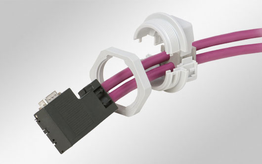</a><figcaption>KVT family example. Cable and plug are not included.<a href="https://www.icotek.com/en-us/products/cable-glands/kvt-45024">Image: icotek ↗</a></figcaption></figure> | 2 bodies; 1 for DC + 1 for USB | **icotek KVT 20 · 45024** — Split entries retain the factory barrel and USB connectors. KT inserts are listed separately below. Confirm supplied locknut/seal, connector transit, wall thickness and strain relief. The 3D shapes are placeholders, not drilling templates. | [Part / quote · icotek](https://www.icotek.com/en-us/products/cable-glands/kvt-45024) [KVT 20 dimension drawing](https://pim.icotek.com/Produkte/PG02%20Kabelverschraubungen/KVT/KVT%2020/Datenbl%C3%A4tter/45024_KVT%2020_bk.PDF) | Ø40 mm flange, 37 mm overall; USB spacing corrected. Cable inserts, plug passage and wall stack remain pending. |
| □ To buy | USB data cable<figure class="material-photo" data-image-kind="product"><figcaption>Product image<a href="https://www.startech.com/en-us/cables/usb2hab6">Image: StarTech ↗</a></figcaption></figure> | 1 | **StarTech USB2HAB6 · USB-A to USB-B, 6 ft / 1.8 m** — USB-B fits the logger data port; USB-A needs a compatible host port. Choose a host-compatible cable instead if the ELOG computer only has USB-C. Retain both factory connectors. | [Buy · StarTech USB2HAB6](https://www.startech.com/en-us/cables/usb2hab6) [Buy · Connection](https://www.connection.com/product/startech.com-usb-2.0-certified-cable-usb-type-a-to-usb-type-b-m-m-black-6ft/usb2hab6/12287011) | To buy · user confirmed no additional cable on hand; check host port and length |
| □ To buy | DIN rail end stops<figure class="material-photo" data-image-kind="reference"><a class="material-image" href="assets/materials/din-stops.jpg" target="_blank" rel="noopener" aria-label="View full image: DIN rail end stops">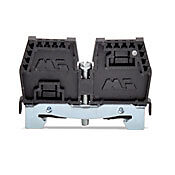</a><figcaption>DN-EB35-A-10 supplier image; sold in packs of 10.<a href="https://www.automationdirect.com/adc/shopping/catalog/wiring_solutions/terminal_blocks/end_brackets/dn-eb35-a-10">Image: AutomationDirect ↗</a></figcaption></figure> | 2 used; linked pack contains 10 | **DINnector DN-EB35-A-10** — Secure both sides of the fuse holder on the 35 mm DIN rail. Check remaining rail length with the purchased holder. | [Buy · AutomationDirect](https://www.automationdirect.com/adc/shopping/catalog/wiring_solutions/terminal_blocks/end_brackets/dn-eb35-a-10) | To buy · one pack supplies more than needed |
| □ To buy | DC / USB sealing inserts<figure class="material-photo" data-image-kind="reference"><a class="material-image" href="assets/materials/kt-inserts.jpg" target="_blank" rel="noopener" aria-label="View full image: DC / USB sealing inserts">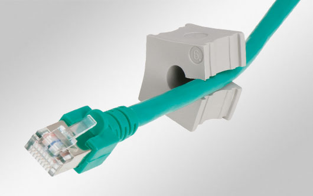</a><figcaption>KT family example. Cable is not included; bore sizes are pending.<a href="https://www.icotek.com/en-us/products/cable-grommets/kt-gy">Image: icotek ↗</a></figcaption></figure> | 2; one per split entry | **icotek KT small · bore sizes pending** — One insert for the measured DC cable and one for the selected USB cable. Request compatibility with KVT 20 / 45024; do not choose the bore from connector size. | [Select size / quote · icotek KT](https://www.icotek.com/en-us/products/cable-grommets/kt-gy) | Measure first · specify both cable ODs when requesting the quote |
| □ To buy | Internal L / N / PE wire<figure class="material-photo" data-image-kind="reference"><figcaption>Kit example. Select the required wire colors and spool size.<a href="https://www.remingtonindustries.com/hook-up-wire/hook-up-wire-14-awg-600v-pvc-stranded-kit-2-color-sets-2-spool-sizes-available/">Image: Remington ↗</a></figcaption></figure> | Black, white and green; cut lengths after routing | **Remington 14UL1015STRKITS · 14 AWG stranded, 600 V UL1015** — Buy one 6-color kit with 25 ft per spool; use black for hot, white for neutral and green for PE. Includes the PE bridge and separate metalwork bonds. Extra kit colors are spare. Confirm wire/terminal acceptance and assembly ampacity; the blue sensing pigtails do not replace this wire. | [Configure / buy · Remington kit](https://www.remingtonindustries.com/hook-up-wire/hook-up-wire-14-awg-600v-pvc-stranded-kit-2-color-sets-2-spool-sizes-available/) [UL1015 data](https://www.remingtonindustries.com/content/UL1015%20Hook%20Up%20Wire%20Data%20Sheet.pdf) | Candidate wire · finalize conductor and insulation selection before cutting |
| □ To buy | Ring terminals<figure class="material-photo" data-image-kind="reference"><figcaption>Family reference (#8 pictured); order the specified #10 version.<a href="https://www.digikey.com/en/products/detail/3m/MV14-8R-LX-BOTTLE/2666579">Image: DigiKey ↗</a></figcaption></figure> | 2 for Q0 + required PE lug ends; allow spares | **3M MV14-10R/LX-BOTTLE · #10 stud, 16–14 AWG** — Two Q0 terminals are #10-32 studs. The former #8 alternative has been removed. Other PE terminations must match their own studs. | [Buy #10 option · DigiKey](https://www.digikey.com/en/products/detail/3m/MV14-10R-LX-BOTTLE/2670218) [3M dimensional data](https://multimedia.3m.com/mws/media/61020O/ring-tongues-vinyl-insulated-brazed-seam-16-14-awg.pdf) | Q0 requires #10 rings; use separate #6-32 mounting screws. Confirm each PE stud, insulation OD and crimp tool. |
| □ To buy | Device-box grounding screw<figure class="material-photo" data-image-kind="product"><a class="material-image" href="assets/materials/box-ground-screw.jpg" target="_blank" rel="noopener" aria-label="View full image: Device-box grounding screw">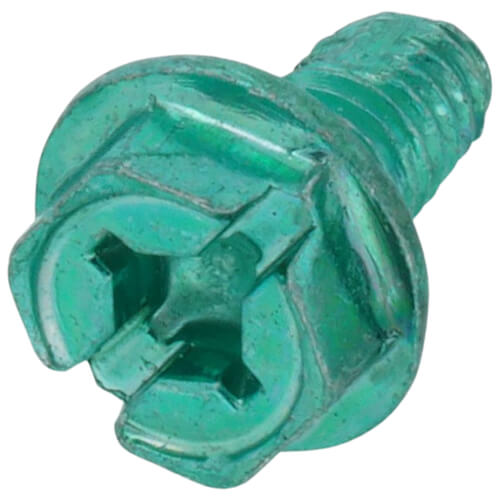</a><figcaption>Product image<a href="https://www.supplyhouse.com/Ideal-30-3194-Thread-Forming-Hole-Finding-Combination-Hex-Grounding-Screw-Card-of-50">Image: SupplyHouse ↗</a></figcaption></figure> | 1 used; pack of 50 | **IDEAL 30-3194** — Dedicated grounding screw candidate for the metal XA box. Match the box ground hole and terminal. The panel and rail need their own approved bonding fasteners, listed separately; painted mounting screws are not a substitute. | [Buy · SupplyHouse](https://www.supplyhouse.com/Ideal-30-3194-Thread-Forming-Hole-Finding-Combination-Hex-Grounding-Screw-Card-of-50) [IDEAL grounding catalog](https://www.idealind.com/content/dam/electrical/support/P-070%20FullLineCatalog2018.pdf) | Confirm box ground-hole thread and engagement |
| □ To buy | Rear-box wire-entry protection<figure class="material-photo" data-image-kind="reference"><a class="material-image" href="assets/materials/box-entry.jpg" target="_blank" rel="noopener" aria-label="View full image: Rear-box wire-entry protection">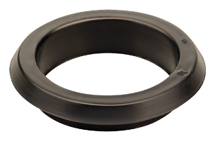</a><figcaption>TG grommet family reference.<a href="https://www.heyco.com/products/bushings-grommets-heycaps-plugs/tubing-caps-and-plugs/heyco-ul-listed-thermoplastic-rubber-grommets/">Image: Heyco ↗</a></figcaption></figure> | 1 entry; final fitting subject to approval | **Heyco G1508 / TG 875 · internal-entry candidate** — Candidate edge protection for a 22.2 mm opening in the rear metal box, inside the outer enclosure. Check actual sheet thickness, conductor bundle and retention; this grommet is not strain relief or a substitute for any required listed wiring fitting. | [Buy candidate · Mouser](https://www.mouser.com/ProductDetail/Heyco/G1508?qs=J6YSCTFSniBvhVAN2sASUg%3D%3D) [Heyco dimensions · p.6-9](https://www.heyco.com/pdf/Heyco_Cat_115.pdf) | 0.8–2.0 mm metal panel range; not for the 4.8 mm enclosure wall. Grommet provides edge protection, not strain relief; wiring-method acceptance pending. |
| □ To buy | Unused-opening closures<figure class="material-photo" data-image-kind="reference"><a class="material-image" href="assets/materials/knockout-seals.jpg" target="_blank" rel="noopener" aria-label="View full image: Unused-opening closures">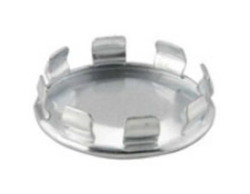</a><figcaption>Supplier family image; order the specified 1042 size.<a href="https://www.platt.com/p/0794385/hubbell-raco/knockout-seal-1-2-snap-in-steel/050169010426/rac1042">Image: Platt ↗</a></figcaption></figure> | Only for opened, unused 1/2 in trade knockouts | **RACO 1042** — Close any unused knockout that has been removed. Leave intact factory knockouts intact; this is a conditional spare, not an instruction to open extra holes. | [Buy · Platt RACO 1042](https://www.platt.com/p/0794385/hubbell-raco/knockout-seal-1-2-snap-in-steel/050169010426/rac1042) [RACO specification](https://hubbellcdn.com/specsheet/RACO_CA-1042-SPEC-EN.pdf) | Conditional purchase · count opened unused holes after fabrication |
| □ To buy | Screw-fixed cable mounts<figure class="material-photo" data-image-kind="product"><figcaption>Product image<a href="https://www.biscoind.com/en-US/panduit-cable-ties-and-accessories-tm2s8-c/p">Image: bisco industries ↗</a></figcaption></figure> | Routing allowance: 8–12; finalize during dry fit | **Panduit TM2S8-C** — Screw-mounted bases for the retained leads and separate power/signal routes. Match #8 / M4 fasteners to the mounting stack. Do not rely on adhesive alone. Linked package contains 100. | [Buy · bisco industries](https://www.biscoind.com/en-US/panduit-cable-ties-and-accessories-tm2s8-c/p) | To buy · estimated count, no mounting-hole pattern released |
| □ To buy | Cable ties<figure class="material-photo" data-image-kind="product"><figcaption>Product image<a href="https://www.platt.com/p/0013556">Image: Platt ↗</a></figcaption></figure> | Routing allowance: 12–20; pack of 100 | **Panduit PLT2S-C · 188 × 4.8 mm** — For small wire bundles and the screw-fixed bases. Keep allowed bend radii and avoid crushing insulation. This length is for cables, not a strap around the meter. | [Buy · Newark](https://www.newark.com/panduit/plt2s-c/cable-tie-nat-188x4-8mm-pk100/dp/24M6057) | To buy · final count after lead routing |
| □ To buy | Wire and component labels<figure class="material-photo" data-image-kind="reference"><a class="material-image" href="assets/materials/labels.jpg" target="_blank" rel="noopener" aria-label="View full image: Wire and component labels">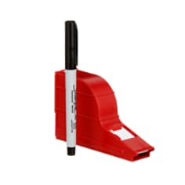</a><figcaption>SWD dispenser shown; this row also includes SLW labels.<a href="https://www.3m.com/3M/en_US/p/dc/v000076616/">Image: 3M ↗</a></figcaption></figure> | 1 SWD dispenser + 1 SLW dispenser; pens included | **3M ScotchCode SWD + SLW** — SWD for smaller wire IDs; SLW for larger cables and longer identification. Match actual cable OD to the 3M size table. Mark both wire ends and Q0, JL, JN, PE, Fv, CT1 and A1/A2/A3. Add durable SUPPLY, PRINTER OUTPUT, Q0 ON/OFF and ELITEpro ADAPTER ONLY — UNMETERED legends. | [Buy SWD · Platt](https://www.platt.com/p/0063831/3m/wire-marker-write-on-dispenser-with-tape-1-3-8-in-l-x-3-4-in-w-lab/054007119548/mmmswd) [Buy SLW · Specialized Products](https://www.specialized.net/3m-slw-scotchcode-write-on-dispenser-w-pen.html) [3M sizes / cable OD ranges](https://multimedia.3m.com/mws/media/1854486O/ft-scotchcode-slw-us-pdf.pdf) | SWD fits 3.58 mm internal wire; SLW fits approximately 9.2 mm cord. Measure pigtails and verify adhesion. |
| □ To buy | Mounting and bonding hardware<figure class="material-photo" data-image-kind="reference"><figcaption>Machine-screw reference illustration. Nuts, washers and final sizes are selected separately.<a href="https://boltdepot.com/Machine_screws">Image: Bolt Depot ↗</a></figcaption></figure> | 1 matched set; count from final mounting schedule | **Machine screws, nuts, flat/locking washers and approved bonding hardware** — Cover the DIN rail, four carriers, tie bases, logger restraint, Q0 support, XA box and faceplate stack. Include separate panel and rail PE bolt/lug connections. Check hardware included with each part before ordering duplicates. | [Select / buy machine screws · Bolt Depot](https://boltdepot.com/Machine_screws) [Select matching nuts / washers · Bolt Depot](https://boltdepot.com/Catalog-Tabs?F_Units=US) | Q0 mount: #6-32, max 4.95 mm insert depth; Q0 studs: #10-32; WAGO carriers: M3 or ST2.9; tie mounts: #8/M4. Lengths, counts and bonding stacks pending. |
| □ To buy | Q0 / XA wall supports<figure class="material-photo" data-image-kind="design"><a class="material-image" href="assets/materials/wall-inserts.svg" target="_blank" rel="noopener" aria-label="View full image: Q0 / XA wall supports">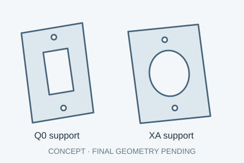</a><figcaption>Design concept · not yet fabricated</figcaption></figure> | 2 custom mounting inserts / supports | **Fabricate to approved measurements** — Support Q0 on the front wall and XA / rear box on the right wall. Confirm wall taper, thickness, load and electrical insulation requirements. The illustrated inserts are envelopes, not fabrication drawings. | [Fabrication quote · Xometry CNC](https://www.xometry.com/capabilities/cnc-machining-service/) | Hold fabrication: wall taper and CAD intersections require resolved Q0 / outlet support and aperture drawings. |
| □ To buy | Q0 terminal guard<figure class="material-photo" data-image-kind="design"><a class="material-image" href="assets/materials/terminal-guard.svg" target="_blank" rel="noopener" aria-label="View full image: Q0 terminal guard">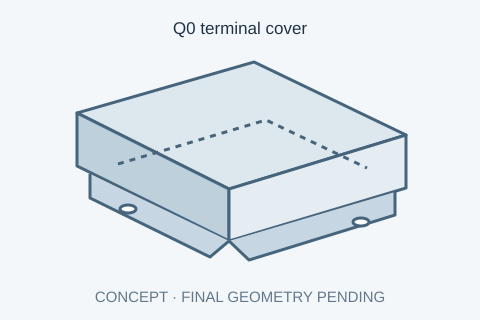</a><figcaption>Design concept · not yet fabricated</figcaption></figure> | 1 guard over both live studs | **Custom guard or manufacturer-approved terminal covers** — Prevent contact with Q0 studs and keep the mains terminals separated from signal cables. Use an approved insulating material and fastening scheme; ordinary hobby-print plastic has not been specified. Include any further covers required by the termination review. | [Fabrication quote · Xometry CNC](https://www.xometry.com/capabilities/cnc-machining-service/) [Carling terminal dimensions](https://www.carlingtech.com/sites/default/files/documents/C-Series_datasheet.pdf) | Hold fabrication: stud, ring, insulation, tool access and clearance envelope not yet defined. |
| □ To buy | Logger cradle and straps<figure class="material-photo" data-image-kind="design"><a class="material-image" href="assets/materials/logger-restraint.svg" target="_blank" rel="noopener" aria-label="View full image: Logger cradle and straps">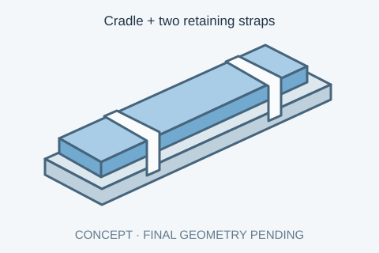</a><figcaption>Design concept · not yet fabricated</figcaption></figure> | 1 cradle + 2 straps cut to fit | **Custom cradle + VELCRO ONE-WRAP 91808 roll candidate** — Hold the long logger without drilling its housing or loading its connectors. Fix the cradle mechanically to the panel; cut straps from the roll with adequate overlap. Confirm material, retention and access to all ports. | [Buy strap roll · Micro Center](https://www.microcenter.com/product/658718/91808-one-wrap-roll-12) [Cradle fabrication quote · Xometry CNC](https://www.xometry.com/capabilities/cnc-machining-service/) | Custom cradle and strap fit pending · not validated as a restraint |

## Software and lab equipment

Arrange access separately from the enclosure purchases. These resources are not marked as owned.

- **ELOG software — Download / install; no separate software purchase.** Use DENT ELOG for configuration, recording and data retrieval. Installation on the lab computer has not been verified. [DENT download](https://www.dentinstruments.com/software-downloads/elog-software-elitepro-xc-sp-power-meters/)
- **ELOG computer and printer under test — Arrange lab equipment.** Need a supported Windows computer with a matching USB port and the printer with its original grounded cord. These are setup resources, not checked as owned or counted as enclosure purchases; no replacement printer or computer has been selected.
- **Assembly and acceptance equipment — Arrange qualified assembly / lab tools.** Calipers, wire stripper, terminal-matched crimper, torque tools, machining/deburring tools, PE/polarity/insulation test equipment and an independent power reference. Arrange access before assembly; tool ratings and procedures belong to the approved build process.

## Layout choice

Use **Hammond PCJ16148CC + 14R1513** as the proposed enclosure / steel panel. The panel is approximately **327 × 374.7 mm**, from the manufacturer's drawing and STEP assembly. The current DENT meter specification is **216 × 63 × 47 mm**. The older manual gives **203 × 69 × 58 mm**, so measure the photographed unit before drilling. [Hammond drawing](https://www.hammfg.com/files/parts/pdf/PCJ16148CC.pdf), [DENT current datasheet](https://www.dentinstruments.com/wp-content/uploads/ELITEproXC_Datasheet_01272026.pdf).

With the 216 mm case at its proposed panel position, the body leaves approximately 71 mm at its sensing end and 87 mm at its power/USB end to the panel edges. Plugs, bending, restraint and tolerances consume that space. The logger is on the right; distribution, Fv and the retained voltage leads occupy the left. These allocations explain choosing a larger enclosure; they are not proof that every cable bundle fits.

The enclosure geometry is imported without scaling from Hammond's STEP file. Its full assembly bounds, including feet and molded projections, are about 393.8 × 479.4 × 240.2 mm. These differ from the catalog's nominal 16 × 14 × 8 in. The unmodified CAD does not contain the proposed machined openings. The 3D view uses one unit per millimetre for every part.

Q0 now has its handle on the front wall, and XA is on the right wall. Both retain their mains terminations inside. XA's metal rear box sits above the meter in the model: nominal vertical body gap is about 17 mm, before wiring and tolerances. The black adapter stays outside, with its original DC lead returning through a split entry. A transparent-wall viewing mode lets you inspect the closed enclosure; the real walls are gray and only the cover is clear.

## Electrical arrangement

Q0 output feeds JL. JL branches to the printer hot through CT1, XA adapter outlet, and Fv → A1 → L1. JN supplies printer neutral, XA neutral, A2 → L2 and A3 → N. Protective earth bonds the printer output, XA, outlet box, steel backpanel and rail. JPE uses two bridged five-port connectors for six external connections plus the two bridge ends, leaving two spare ports. No N–PE bond is added.

The adapter and voltage tap branch before CT1. Only printer hot passes through CT1 once. CT white/+ and black/− connect to the meter's current-input CH1. S is a shield input; the opposite analog block is not the CT input. Configure and verify ELOG recording before using the single-breaker routine.

## Items to resolve before ordering the remaining parts or drilling

1. The user identified UltiMaker S5, Bambu Lab P2S and Prusa CORE One+; this design handles one at a time. Read the actual AC nameplates and supply arrangement. Approve Q0 rating, inrush response, fault rating, operating duty and total shared load. The proposed 5-15 interfaces limit the assembly to at most 15 A; this is not approval to run a 15 A continuous load.
2. Identify the blue pigtails and obtain their ratings. Select the Fv fuse value and confirm all terminal acceptance, including tinned ends. No guessed fuse value or assumption that the main breaker protects these small leads is used.
3. Measure the actual logger, CT, adapter, mated voltage connectors and cable ODs. Store the complete lead lengths with their permitted bends. The model's coils show reserved routing space, now include a calculated 2 m flexible-length scenario at an assumed 3 mm OD; actual supplied lengths, bending and transitions remain unverified.
4. Dry-fit the 5261, 670RAC box, 84004-40 plate and insulating wall insert together. Check screw patterns, wall taper, thread engagement, rear terminations, box wire-entry fittings and all metal bonds. The illustrated insert envelopes are not fabrication dimensions.
5. Finalize Q0 mounting insert and terminal guard, rail end stops, logger restraint, coil ties, terminal guards, gland / split-entry holes and sealing. Machining the box does not automatically retain its original enclosure rating.
6. Have qualified electrical personnel verify PE continuity, polarity, insulation, protection and measurement behavior before release. Nothing here reports a built or energized assembly.

[Installation audit](installation.html) · [Interactive 3D layout and circuit](https://diyunz.github.io/printer-energy-monitor-wiring/) · [Dimension schedule](layout_dimensions.json) · [Primary references](references.html)
