# Materials checklist

September 20, 2026 · upstream protection review. **✓ 5 confirmed owned groups · ✓ 1 kit supplied · □ 19 groups to buy or fabricate**

One grounded 120 V supply, one printer at a time. Five equipment groups are confirmed on hand; the USB cable is kit supplied. Log independently during printing and download only with mains unplugged. The voltage tap uses upstream Q0 protection only. Its suitability for the original DENT leads, Q0 site/startup suitability, CT scaling and physical acceptance remain open; this is not an energizing release.

**Inventory basis:** Five equipment groups confirmed by the user: ELITEpro XC, CTs, three user-confirmed original DENT kit pigtails in different colors, matching long leads and original black adapter. DENT specifies an included 1.8 m USB-A to B cable; the photographed kit card places it in the lid pocket. Its present physical location has not been confirmed. Reuse it before buying a replacement.

A check means on hand, not electrically approved. Counts refer to material groups, not individual pieces. Needed quantities and vendor pack sizes differ. The USB cable is **kit supplied**; locate it before purchasing a replacement. Kit inclusion does not confirm its current physical presence.

Buy links go to specific products; Select / Configure links need a size or rating first; Quote / Fabrication links require a supplier quote or a final custom drawing. Check current stock, minimum orders and lead times with each supplier. No orders have been placed.

Photos identify the equipment or candidate part. Family examples and unfinished custom parts are labeled. Images are not at a common scale; use the dimension schedule and 3D layout for size comparisons. Click an image to view the original. Use **View in 3D** to highlight each material’s installation locations. Image sources are credited below each picture.

## ✓ Equipment to reuse

| Inventory | Item | Quantity needed | Part and purpose | Purchase / source | Remaining checks |
|---|---|---|---|---|---|
| ✓ Owned | Power logger<figure class="material-photo" data-image-kind="user"><a class="material-image" href="assets/materials/meter.jpg" target="_blank" rel="noopener" aria-label="View full image: Power logger">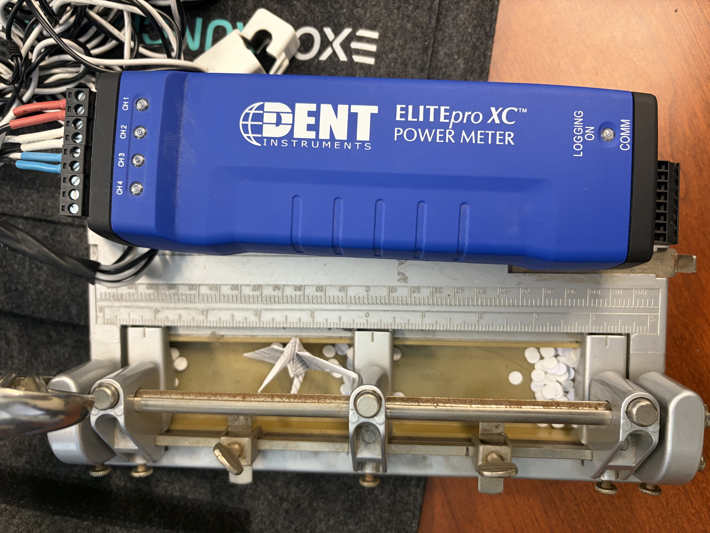</a><figcaption>Your equipment · supplied photo</figcaption></figure><a class="locate-material" data-material="meter" href="index.html?material=meter#layout" aria-label="View Power logger in 3D">View in 3D ↑</a> | 1 | **DENT ELITEpro XC** — Reuse the photographed logger. Adjustable straps reserve 216 × 69 × 58 mm, covering both published case envelopes; the visible model retains the current slender 216 × 63 × 47 mm specification. | Reuse · No purchase needed | Owned; confirm actual envelope and connector access before fitting straps. |
| ✓ Owned | Current sensor<figure class="material-photo" data-image-kind="user"><a class="material-image" href="assets/materials/ct.jpg" target="_blank" rel="noopener" aria-label="View full image: Current sensor">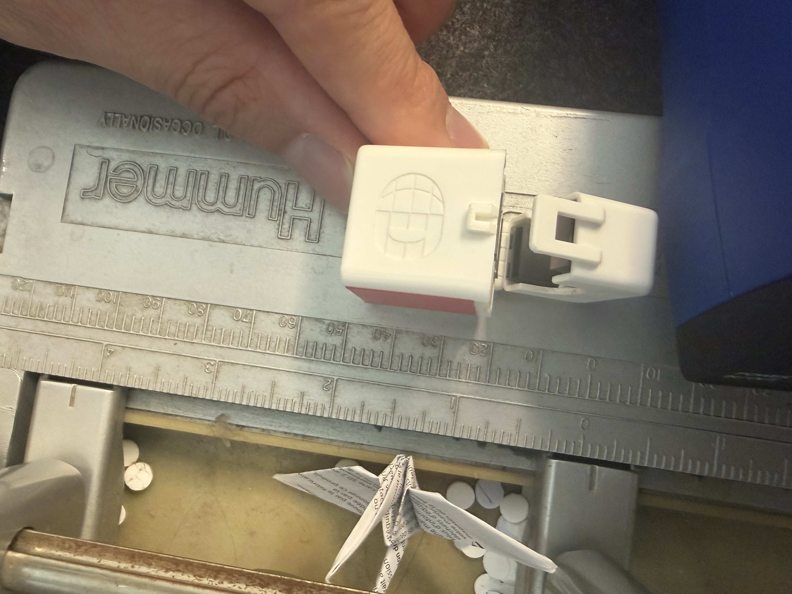</a><figcaption>Your equipment · supplied photo</figcaption></figure><a class="locate-material" data-material="ct" href="index.html?material=ct#layout" aria-label="View Current sensor in 3D">View in 3D ↑</a> | 1 required; existing set available | **DENT Mini HSC · probable CTHSC-050-U/B** — The white hinged case, label layout and partially visible “DENT 50…” match the legacy Mini HSC 50 A / 333.3 mV product. This is a probable variant identification: wires obscure the complete model. DENT 20 A and 50 A Mini HSC versions share the body and 10 mm aperture; both accommodate one printer-hot conductor. Set ELOG from the uncovered label at commissioning, not from appearance. | [DENT Mini HSC specifications](https://www.dentinstruments.com/shop/current-sensors/hinged-current-transformers-sensors-for-energy-metering/) [DENT CT datasheet](https://www.dentinstruments.com/wp-content/uploads/CT-HSC-XXX-U_Datasheet_06132024.pdf) | Owned · Mini HSC family matched; 50 A variant probable, final scale check required. |
| ✓ Owned | DENT voltage pigtails<figure class="material-photo" data-image-kind="user"><a class="material-image" href="assets/materials/blue-leads.jpg" target="_blank" rel="noopener" aria-label="View full image: DENT voltage pigtails">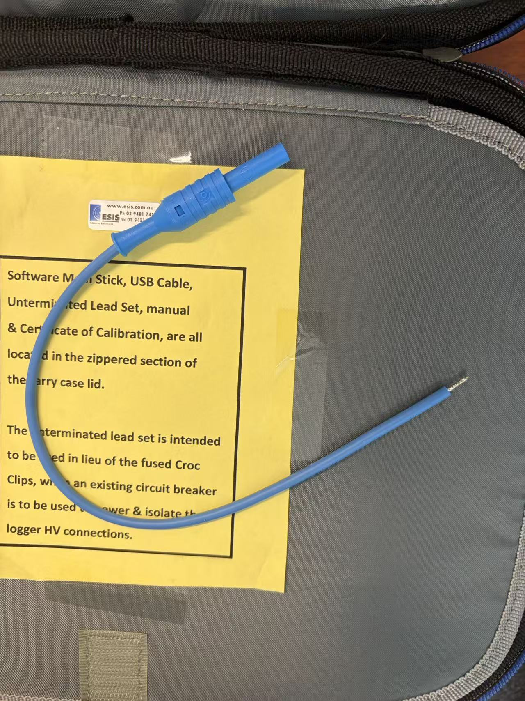</a><figcaption>Your equipment · one blue example; the three owned pigtails have different colors</figcaption></figure><a class="locate-material" data-material="blue-leads" href="index.html?material=blue-leads#layout" aria-label="View DENT voltage pigtails in 3D">View in 3D ↑</a> | 3 | **DENT LD-SKTSP series · 10 in / 254 mm nominal** — User confirms three original DENT kit pigtails in different colors, all with the same voltage-sensing function. The connector, tinned end and ESIS card match the LD-SKTSP family. A1 feeds L1 hot; A2/A3 feed L2/N neutral. Colors identify connections; these leads do not carry printer load current or serve as PE. | [DENT original product](https://www.dentinstruments.com/shop/elitepro-accessories-replacement-parts/replacement-unterminated-voltage-leads-10-for-elitepro-series/) | Owned · DENT original kit configuration confirmed by user; no replacement planned. Terminal preparation and protection still need acceptance. |
| ✓ Owned | Full voltage leads<figure class="material-photo" data-image-kind="user"><a class="material-image" href="assets/materials/voltage-leads.jpg" target="_blank" rel="noopener" aria-label="View full image: Full voltage leads">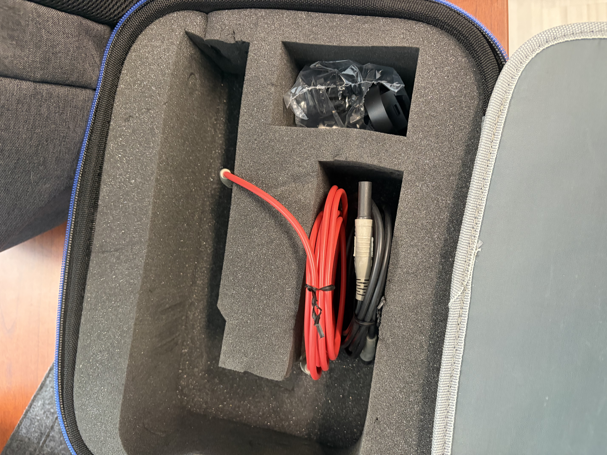</a><figcaption>Your equipment · supplied photo</figcaption></figure><a class="locate-material" data-material="voltage-leads" href="index.html?material=voltage-leads#layout" aria-label="View Full voltage leads in 3D">View in 3D ↑</a> | 1 set; 3 leads used | **Existing matching voltage lead set** — Mate with the three OEM voltage pigtails and retain the full factory leads. Check connector compatibility, insulation and bend allowance. | Reuse · No purchase needed | On hand · confirmed by user; no replacement set planned |
| ✓ Owned | AC/DC adapter<figure class="material-photo" data-image-kind="user"><a class="material-image" href="assets/materials/adapter.jpg" target="_blank" rel="noopener" aria-label="View full image: AC/DC adapter">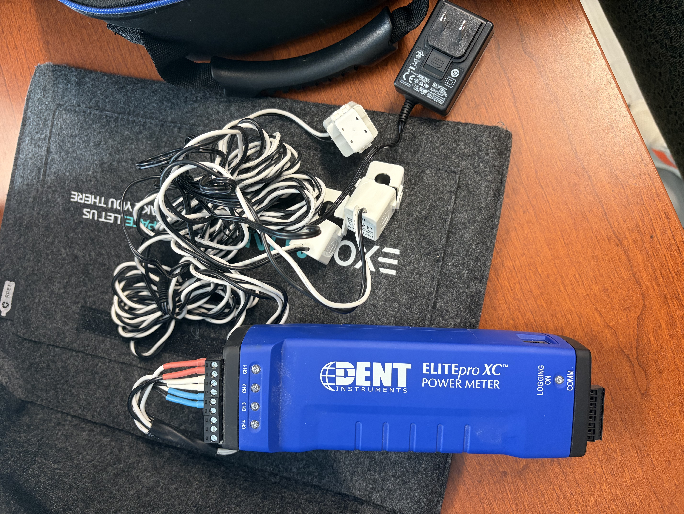</a><figcaption>Your equipment · supplied photo</figcaption></figure><a class="locate-material" data-material="adapter" href="index.html?material=adapter#layout" aria-label="View AC/DC adapter in 3D">View in 3D ↑</a> | 1 with original barrel cable | **CUI SMI6-9-V-P5 · existing original adapter** — Original label identifies CUI SMI6-9-V-P5: 9 V DC, 0.667 A, center positive; compatible with the meter’s 6–10 V / 500 mA input. Official SMI6 drawing: 64 × 40.5 × 30 mm ±1 mm, excluding blades; P5 plug 5.5/2.1 × 9.5 mm. Keep its flat UL2468 cord outside the enclosure and mate it to the specified round DC extension. | [CUI original SMI6 datasheet](https://www.belfuse.com/media/datasheets/products/power-supplies/SMI6.pdf) | Owned · output, polarity and plug matched; original flat cord stays outside. |
| ✓ Kit included | USB data cable<figure class="material-photo" data-image-kind="reference"><a class="material-image" href="assets/materials/usb.jpg" target="_blank" rel="noopener" aria-label="View full image: USB data cable">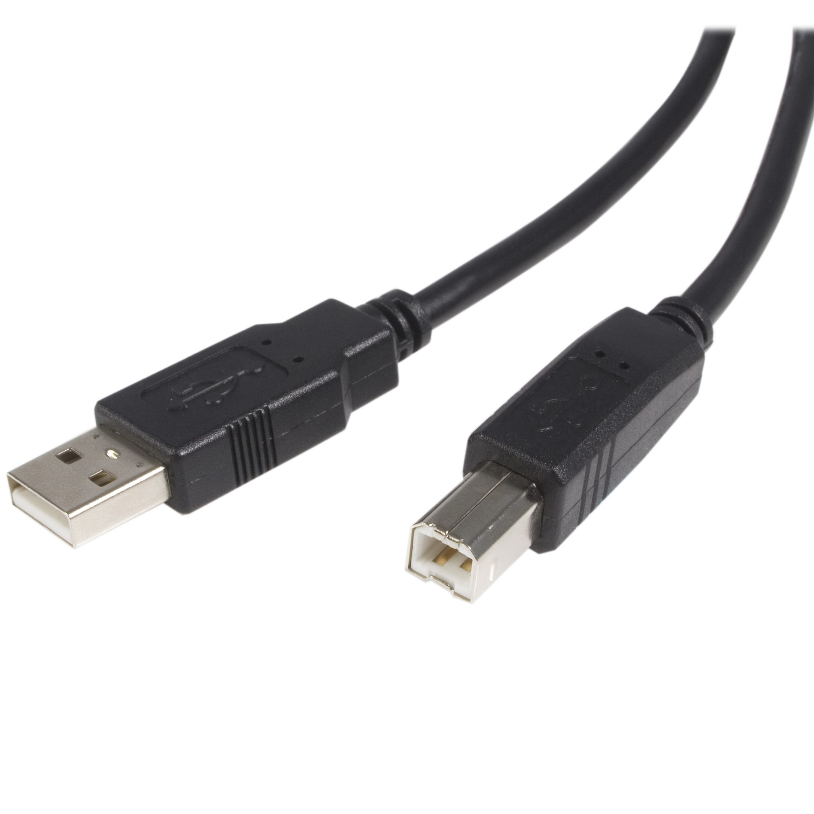</a><figcaption>Connector reference (StarTech image). Reuse the supplied DENT cable; jacket dimensions are not inferred from this image.<a href="https://www.startech.com/en-us/cables/usb2hab6">Image: StarTech ↗</a></figcaption></figure><a class="locate-material" data-material="usb" href="index.html?material=usb#layout" aria-label="View USB data cable in 3D">View in 3D ↑</a> | 1 | **DENT kit USB-A to USB-B cable · 1.8 m** — Supplied with ELITEpro XC. Use temporarily for setup and batch downloads with the box mains unplugged and absence of mains voltage verified. Remove USB before closing and powering the enclosure. No USB wall opening, insert or permanent cable is required. | [DENT kit contents](https://www.dentinstruments.com/wp-content/uploads/ELITEproXC_Datasheet_01272026.pdf) [DENT USB instructions](https://www.dentinstruments.com/wp-content/uploads/EXC_ELOG19_11-15-24.pdf) | Kit included · locate in the lid pocket; check the computer port and cable condition. Physical presence is not yet confirmed. |

## □ Purchase and fabrication list

| Inventory | Item | Quantity needed | Part and purpose | Purchase / source | Remaining checks |
|---|---|---|---|---|---|
| □ To buy | Enclosure<figure class="material-photo" data-image-kind="product"><a class="material-image" href="assets/materials/enclosure.jpg" target="_blank" rel="noopener" aria-label="View full image: Enclosure">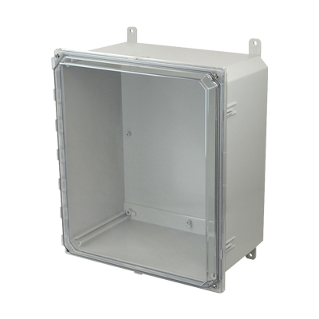</a><figcaption>Product image<a href="https://www.solutionsdirectonline.com/hammond-16x14x8-polycarbonate-electrical-enclosure-with-clear-cover-pcj16148cc">Image: Solutions Direct ↗</a></figcaption></figure><a class="locate-material" data-material="enclosure" href="index.html?material=enclosure#layout" aria-label="View Enclosure in 3D">View in 3D ↑</a> | 1 | **Hammond PCJ16148CC** — Gray polycarbonate body with a clear lift-off lid. Selected for connector clearance and lead storage around the long meter. Nominal 16 × 14 × 8 in; use the manufacturer drawing/CAD for real outside dimensions. | [Buy · Solutions Direct](https://www.solutionsdirectonline.com/hammond-16x14x8-polycarbonate-electrical-enclosure-with-clear-cover-pcj16148cc) [Hammond drawing](https://www.hammfg.com/files/parts/pdf/PCJ16148CC.pdf) | Machined STEP / wall drawing supplied; compare received parts and close release items before cutting. |
| □ To buy | Mounting panel<figure class="material-photo" data-image-kind="product"><a class="material-image" href="assets/materials/panel.jpg" target="_blank" rel="noopener" aria-label="View full image: Mounting panel">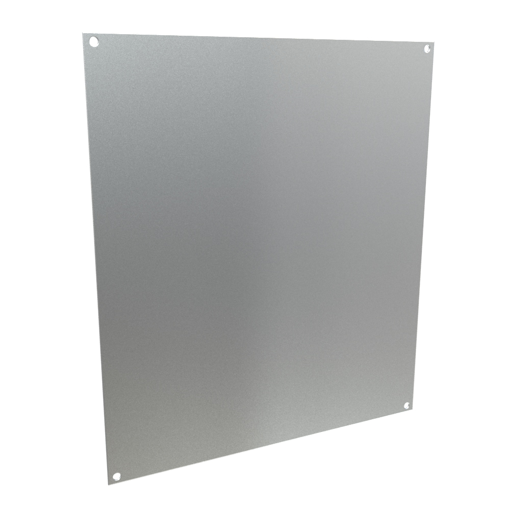</a><figcaption>Product image<a href="https://www.hammfg.com/part/14R1513">Image: Hammond ↗</a></figcaption></figure><a class="locate-material" data-material="panel" href="index.html?material=panel#layout" aria-label="View Mounting panel in 3D">View in 3D ↑</a> | 1 | **Hammond 14R1513** — Steel panel, approximately 327 × 374.7 × 1.9 mm. Ordered separately from the box. Provide its own PE bond; do not depend on painted mounting screws. | [Buy · DigiKey](https://www.digikey.com/en/products/detail/hammond-manufacturing/14R1513/2359585) [Hammond](https://www.hammfg.com/part/14R1513) | Panel cut/slot drawing supplied. Transfer-drill WAGO carrier holes from the actual carriers. |
| □ To buy | Q0 operating breaker<figure class="material-photo" data-image-kind="reference"><a class="material-image" href="assets/materials/breaker.jpg" target="_blank" rel="noopener" aria-label="View full image: Q0 operating breaker">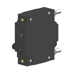</a><figcaption>C-series reference image from the selected part listing.<a href="https://www.mouser.kr/ProductDetail/Carling-Technologies/CA1-B0-24-615-121-DG?qs=vln4JGBFwFoweMB2W4WfRg%3D%3D">Image: Mouser ↗</a></figcaption></figure><a class="locate-material" data-material="breaker" href="index.html?material=breaker#layout" aria-label="View Q0 operating breaker in 3D">View in 3D ↑</a> | 1 | **Carling CA1-B0-24-615-121-DG** — Single 15 A operating breaker, 50/60 Hz medium-delay, UL489/CSA option DG. Mount directly on the front wall using the manufacturer pattern. No custom wall insert. Keep all four cover screws installed; Q0 OFF leaves its supply terminal live. | [Quote / availability · Mouser](https://www.mouser.com/ProductDetail/Carling-Technologies/CA1-B0-24-615-121-DG?qs=vln4JGBFwFoweMB2W4WfRg%3D%3D) [Carling specification](https://www.carlingtech.com/sites/default/files/documents/C-Series_datasheet.pdf) [Carling delay curves](https://www.carlingtech.com/sites/default/files/documents/Carling-HM-CB-Time-Delays.pdf) | Manufacturer table confirms 10 kA interruption at 120 V AC for the selected UL489 configuration; delay 24 has specified half-cycle inrush tolerance. Actual JIS outlet fault current and combined startup waveform are not published. Exact-SKU stock/lead time still needs a supplier quote. |
| □ To buy | XA adapter receptacle<figure class="material-photo" data-image-kind="product"><a class="material-image" href="assets/materials/receptacle.png" target="_blank" rel="noopener" aria-label="View full image: XA adapter receptacle">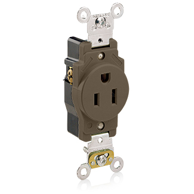</a><figcaption>Leviton 5279-C flanged outlet<a href="https://leviton.com/products/5279-c">Image: Leviton ↗</a></figcaption></figure><a class="locate-material" data-material="receptacle" href="index.html?material=receptacle#layout" aria-label="View XA adapter receptacle in 3D">View in 3D ↑</a> | 1 | **Leviton 5279-C · NEMA 5-15R flanged outlet** — One complete panel-mounted outlet replaces the old 5261 receptacle, RACO rear box, separate plate and custom support. Its molded body encloses the wire terminals. Dedicated to the existing ELITEpro adapter. | [Buy · Crescent Electric](https://www.crescentelectric.com/product/98283/5279-c-grounding-outlet-receptacle-125-v-ac-15-a-2-poles-3-wires-white) [Leviton drawing / instructions](https://leviton.com/products/5279-c) | Selected: Ø44.00 ±0.15 mm opening; 53.57 mm mounting pitch. Dry indoor use. |
| □ To buy | Distribution connectors<figure class="material-photo" data-image-kind="product"><a class="material-image" href="assets/materials/connectors.jpg" target="_blank" rel="noopener" aria-label="View full image: Distribution connectors">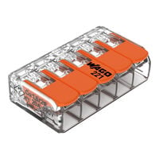</a><figcaption>Product image<a href="https://www.digikey.com/en/products/detail/wago-corporation/221-415/13549457">Image: DigiKey ↗</a></figcaption></figure><a class="locate-material" data-material="connectors" href="index.html?material=connectors#layout" aria-label="View Distribution connectors in 3D">View in 3D ↑</a> | 3 | **WAGO 221-415** — One five-port connector each for JL, JN and PE. JL accepts Q0 output, printer hot, A1 and adapter hot; JN accepts supply, printer, A2, A3 and adapter neutrals; PE accepts supply, printer, panel and outlet earth. One accepted conductor per port. Confirm original DENT pigtail preparation and protective-bonding suitability. | [Buy · DigiKey](https://www.digikey.com/en/products/detail/wago-corporation/221-415/13549457) [WAGO](https://www.wago.com/us/wire-splicing-connectors/compact-splicing-connector/p/221-415) | Three mounting positions in the panel drawing. Conductor acceptance is checked at assembly. |
| □ To buy | Connector carriers<figure class="material-photo" data-image-kind="reference"><a class="material-image" href="assets/materials/carriers.jpg" target="_blank" rel="noopener" aria-label="View full image: Connector carriers">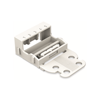</a><figcaption>221-505 product image.<a href="https://www.digikey.com/en/products/detail/wago-corporation/221-505/15568477">Image: DigiKey ↗</a></figcaption></figure><a class="locate-material" data-material="carriers" href="index.html?material=carriers#layout" aria-label="View Connector carriers in 3D">View in 3D ↑</a> | 3 | **WAGO 221-505** — Secure each connector to the backpanel with its carrier. Carrier details are schematic; transfer-drill from received parts. Connectors must not rely on wires for support. | [Buy · DigiKey](https://www.digikey.com/en/products/detail/wago-corporation/221-505/15568477) [WAGO](https://www.wago.com/us/wire-splicing-connectors/mounting-carrier-221-series-24-12-awg/p/221-505) [WAGO carrier drawing](https://www1.futureelectronics.com/doc/WAGO/221-505.pdf) | Three carriers, two M3 fixings each; transfer-drill actual front-foot holes. |
| □ To buy | Mains / printer cord<figure class="material-photo" data-image-kind="product"><a class="material-image" href="assets/materials/cord.jpg" target="_blank" rel="noopener" aria-label="View full image: Mains / printer cord">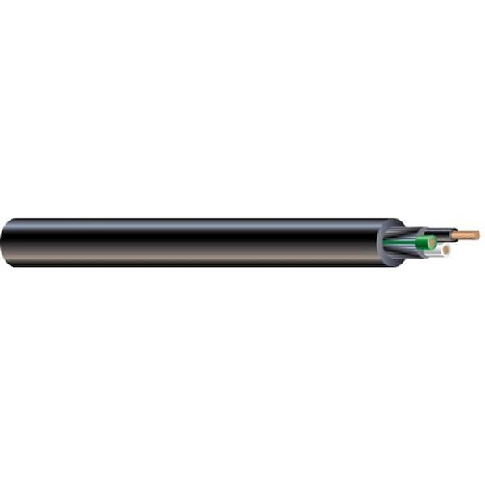</a><figcaption>Product image<a href="https://www.homedepot.com/p/Southwire-By-the-Foot-14-3-300-Volt-CU-Black-Flexible-Portable-Power-SJOOW-Cord-55808699/204633006">Image: Home Depot ↗</a></figcaption></figure><a class="locate-material" data-material="cord" href="index.html?material=cord#layout" aria-label="View Mains / printer cord in 3D">View in 3D ↑</a> | 10 ft (3.048 m): supply blank 2.0 m; output blank 1.0 m | **Southwire 55808699 · 14/3 SJOOW** — Candidate 3-conductor flexible cord for input and printer output. Catalog nominal OD is about 9.17 mm; measure actual cord and choose fittings accordingly. Final current rating depends on the complete assembly and use conditions. | [Buy · Home Depot](https://www.homedepot.com/p/Southwire-By-the-Foot-14-3-300-Volt-CU-Black-Flexible-Portable-Power-SJOOW-Cord-55808699/204633006) | Selected length allowance; final ends trimmed only after dry routing. |
| □ To buy | Supply plug<figure class="material-photo" data-image-kind="product"><a class="material-image" href="assets/materials/supply-plug.png" target="_blank" rel="noopener" aria-label="View full image: Supply plug">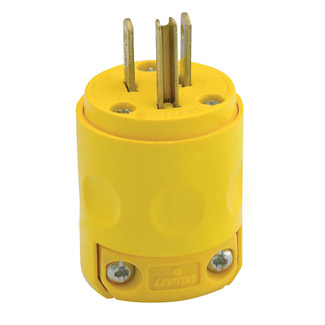</a><figcaption>Product image<a href="https://leviton.com/products/515pv">Image: Leviton ↗</a></figcaption></figure><a class="locate-material" data-material="supply-plug" href="index.html?material=supply-plug#layout" aria-label="View Supply plug in 3D">View in 3D ↑</a> | 1 | **Leviton 515PV · NEMA 5-15P** — Grounded 15 A / 125 V male supply plug for the 14/3 input cord. Check accepted wire size and jacket OD against the chosen cord. | [Buy plug · Home Depot](https://www.homedepot.com/p/Leviton-15-Amp-125-Volt-3-Wire-Plug-Yellow-515PV-YL-R10-515PV-0YL/309610976) [Leviton cord instructions](https://leviton.com/content/dam/leviton/residential/product_documents/instruction_sheet/515_Instruction_Sheet.pdf) | Published 6.22–16.64 mm cord range includes the selected nominal 9.2 mm cord; verify clamping on receipt. |
| □ To buy | Printer output connector<figure class="material-photo" data-image-kind="product"><a class="material-image" href="assets/materials/printer-connector.png" target="_blank" rel="noopener" aria-label="View full image: Printer output connector">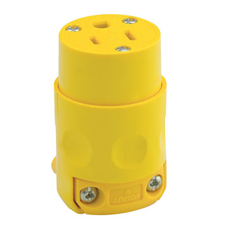</a><figcaption>Product image<a href="https://leviton.com/products/515cv">Image: Leviton ↗</a></figcaption></figure><a class="locate-material" data-material="printer-connector" href="index.html?material=printer-connector#layout" aria-label="View Printer output connector in 3D">View in 3D ↑</a> | 1 | **Leviton 515CV · NEMA 5-15R** — Grounded female cord connector for the measured printer output. The printer connects here; XA is reserved for the meter adapter. | [Buy connector · SupplyHouse](https://www.supplyhouse.com/Leviton-515CV-Residential-Grade-Straight-Blade-Connector-15A-NEMA-5-15R-Yellow-2P-125V) [Leviton cord instructions](https://leviton.com/content/dam/leviton/residential/product_documents/instruction_sheet/515_Instruction_Sheet.pdf) | Published 6.22–16.64 mm cord range includes the selected nominal 9.2 mm cord; verify clamping on receipt. |
| □ To buy | Mains / printer strain relief<figure class="material-photo" data-image-kind="product"><a class="material-image" href="assets/materials/cord-glands.jpg" target="_blank" rel="noopener" aria-label="View full image: Mains / printer strain relief">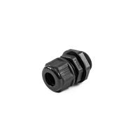</a><figcaption>Hammond 1427NCGPG13LB long-thread gland<a href="https://www.hammfg.com/part/1427NCGPG13LB">Image: Hammond ↗</a></figcaption></figure><a class="locate-material" data-material="cord-glands" href="index.html?material=cord-glands#layout" aria-label="View Mains / printer strain relief in 3D">View in 3D ↑</a> | 2 | **Hammond 1427NCGPG13LB · long PG13.5 thread** — Two long-thread glands for the selected 14/3 SJOOW mains cords. 6–12 mm clamp range covers the published ~9.2 mm cord OD. The 15 mm thread replaces the former short-thread candidate. Includes nylon locknut and EPDM O-ring. | [Buy · DigiKey](https://www.digikey.com/en/products/detail/hammond-manufacturing/1427NCGPG13LB/22152326) [Hammond dimensions](https://www.hammfg.com/part/1427NCGPG13LB) | 15 mm long thread selected for the ~4.8 mm wall; verify full locknut engagement on receipt. |
| □ To buy | DC split cable entry<figure class="material-photo" data-image-kind="reference"><a class="material-image" href="assets/materials/kvt32.png" target="_blank" rel="noopener" aria-label="View full image: DC split cable entry">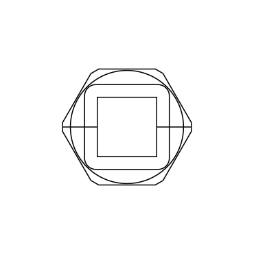</a><figcaption>icotek KVT 32 family photo; inserts selected separately<a href="https://www.icotek.com/en-us/products/cable-glands/kvt-45026">Image: icotek ↗</a></figcaption></figure><a class="locate-material" data-material="split-entries" href="index.html?material=split-entries#layout" aria-label="View DC split cable entry in 3D">View in 3D ↑</a> | 1 | **icotek KVT 32 black · 45026** — One KVT 32 frame for the round factory-terminated Tensility DC extension. Takes one separately ordered KTMBS 4–7 gray insert, 41380. M32 × 1.5, 14 mm thread; Ø32.3 wall opening. Retain the included sealing ring and locknut. | [Buy · RS](https://us.rs-online.com/product/icotek/45026/72428954/) [icotek dimensioned drawing](https://pim.icotek.com/Produkte/PG02%20Kabelverschraubungen/KVT/KVT%2032/Datenbl%C3%A4tter/45026_KVT%2032_bk.PDF) | Selected · DC coordinates retained; one 41380 insert required. No USB wall entry. |
| □ To buy | Round DC extension cable<figure class="material-photo" data-image-kind="product"><a class="material-image" href="assets/materials/dc-extension.jpg" target="_blank" rel="noopener" aria-label="View full image: Round DC extension cable">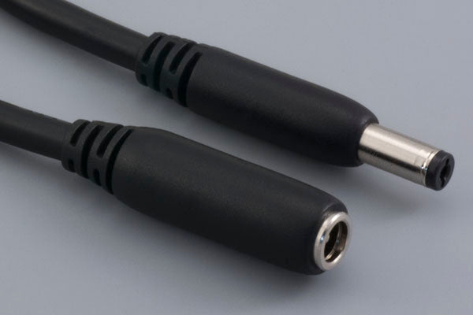</a><figcaption>10-02228 product photo<a href="https://www.tensility.com/products/10-02228">Image: Tensility ↗</a></figcaption></figure><a class="locate-material" data-material="dc-extension" href="index.html?material=dc-extension#layout" aria-label="View Round DC extension cable in 3D">View in 3D ↑</a> | 1; keep the full 0.915 m | **Tensility 10-02228 · 5.5/2.1 mm plug to jack** — Factory round cable, 18 AWG, OD 5.2 ±0.3 mm, 7 A / 48 V; preserves center-to-center polarity. Adapter plugs into the female end outside; route the round cable through 41380/KVT 32 and plug the male end into the logger. Reserve 0.35 m inside and 0.565 m outside, adjusted at dry fit; retain slack with bends ≥35 mm radius (published minimum 31.2 mm). No cut or splice. Male barrel is 12 mm long; do not force its shoulder flush into the logger. | [Buy · Tensility 10-02228](https://www.tensility.com/products/10-02228) [Dimensioned cable drawing](https://tensility.s3.us-west-2.amazonaws.com/imports/product_spec_sheets/10-02228.pdf) | Selected · resolves the flat-cord entry; verify seating, polarity and retention on receipt. |
| □ To buy | DC sealing insert<figure class="material-photo" data-image-kind="reference"><a class="material-image" href="assets/materials/ktmbs-inserts.jpg" target="_blank" rel="noopener" aria-label="View full image: DC sealing insert">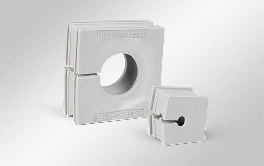</a><figcaption>KTMBS family photo · order small 41380<a href="https://www.icotek.com/en-us/products/cable-grommets/ktmbs-41380">Image: icotek ↗</a></figcaption></figure><a class="locate-material" data-material="kt-inserts" href="index.html?material=kt-inserts#layout" aria-label="View DC sealing insert in 3D">View in 3D ↑</a> | 1 used; manufacturer pack is 10, confirm seller unit | **icotek KTMBS 4–7 gray · 41380** — Split 21 × 21 × 19 mm insert for KVT, rated for round cables 4–7 mm. Accepts Tensility DC OD 5.2 ±0.3 mm. Select KTMBS (split), not unsplit KTMB. The original CUI flat cord stays outside. | [Buy / lead time · Powermatic 41380](https://www.powermatic.net/part/icotek/41380/4218822) [icotek exact product](https://www.icotek.com/en-us/products/cable-grommets/ktmbs-41380) [icotek dimensions and range](https://www.icotek.com/Produkte/PDFs/en_US/KTMBS%20gy.pdf) | Selected · both cable diameters fit; seller lists backorder, confirm lead time. |
| □ To buy | Internal L / N / PE wire<figure class="material-photo" data-image-kind="reference"><a class="material-image" href="assets/materials/internal-wire.jpg" target="_blank" rel="noopener" aria-label="View full image: Internal L / N / PE wire">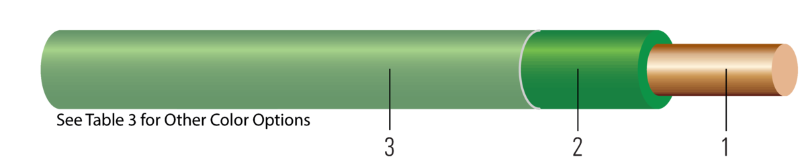</a><figcaption>Southwire 14 AWG stranded THHN family reference<a href="https://www.southwire.com/wire-cable/building-wire/thhn-thwn-copper-silicone-free/p/22955984">Image: Southwire ↗</a></figcaption></figure><a class="locate-material" data-material="internal-wire" href="index.html?material=internal-wire#layout" aria-label="View Internal L / N / PE wire in 3D">View in 3D ↑</a> | Black 3 m; white 2 m; green 3 m minimum. Linked rolls: 100 ft each. | **Southwire 14 AWG, 19-strand Class C, THHN/THWN/MTW, 600 V** — Buy black 22955984, white 22956784 and green 22959184. The selected 14 AWG copper fits the connector and ring-terminal ranges; verify the accepted wiring method. Linked rolls leave spare stock. Wire blanks and preparation are in the build package. | [Black 22955984 · Home Depot](https://www.homedepot.com/p/204834035) [White 22956784 · Home Depot](https://www.homedepot.com/p/204834037) [Green 22959184 · Home Depot](https://www.homedepot.com/p/204834032) [Southwire construction](https://www.southwire.com/wire-cable/building-wire/thhn-thwn-copper-silicone-free/p/22955984) | Selected: manufacturer nominal OD 0.113 in (2.87 mm); 14 AWG fits WAGO and #10 rings. |
| □ To buy | Ring terminals<figure class="material-photo" data-image-kind="reference"><a class="material-image" href="assets/materials/ring-lugs.jpg" target="_blank" rel="noopener" aria-label="View full image: Ring terminals">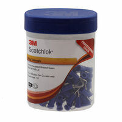</a><figcaption>3M MV14-10R/LX-BOTTLE supplier photo; #10 stud<a href="https://www.digikey.com/en/products/detail/3m/MV14-10R-LX-BOTTLE/2670218">Image: DigiKey / 3M ↗</a></figcaption></figure><a class="locate-material" data-material="ring-lugs" href="index.html?material=ring-lugs#layout" aria-label="View Ring terminals in 3D">View in 3D ↑</a> | 5 minimum: 2 Q0, 1 panel bond + 2 spares | **3M MV14-10R/LX-BOTTLE · #10 stud, 16–14 AWG** — Two Q0 terminals are #10-32 studs. The former #8 alternative has been removed. Other PE terminations must match their own studs. | [Buy #10 option · DigiKey](https://www.digikey.com/en/products/detail/3m/MV14-10R-LX-BOTTLE/2670218) [3M dimensional data](https://multimedia.3m.com/mws/media/61020O/ring-tongues-vinyl-insulated-brazed-seam-16-14-awg.pdf) | Selected #10 hole, 16–14 AWG. Dedicated #10-32 bond bolts in fastener schedule; terminal-matched crimper required. |
| □ To buy | Screw-fixed cable mounts<figure class="material-photo" data-image-kind="product"><a class="material-image" href="assets/materials/tie-mounts.png" target="_blank" rel="noopener" aria-label="View full image: Screw-fixed cable mounts">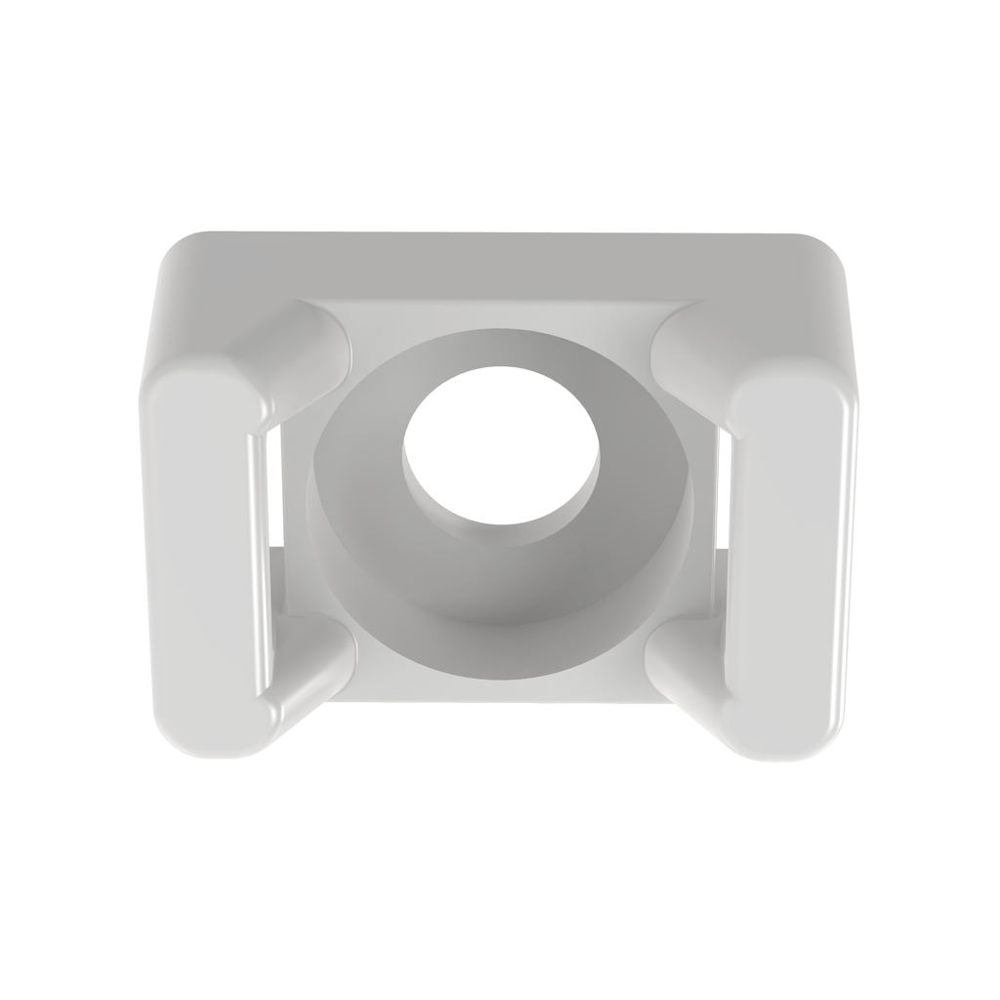</a><figcaption>Product image<a href="https://www.biscoind.com/en-US/panduit-cable-ties-and-accessories-tm2s8-c/p">Image: bisco industries ↗</a></figcaption></figure><a class="locate-material" data-material="tie-mounts" href="index.html?material=tie-mounts#layout" aria-label="View Screw-fixed cable mounts in 3D">View in 3D ↑</a> | 6 installed; pack of 100 | **Panduit TM2S8-C** — Six screw-fixed bases retain the mains bundle, outlet supply, CT pair, two sides of the voltage-lead coils, and DC extension. The linked package contains 100; only six are installed. | [Buy · bisco industries](https://www.biscoind.com/en-US/panduit-cable-ties-and-accessories-tm2s8-c/p) | Six panel locations; M4 × 16 mm screws, underside washers and locknuts in the fastener schedule. |
| □ To buy | Cable ties<figure class="material-photo" data-image-kind="product"><a class="material-image" href="assets/materials/cable-ties.jpg" target="_blank" rel="noopener" aria-label="View full image: Cable ties">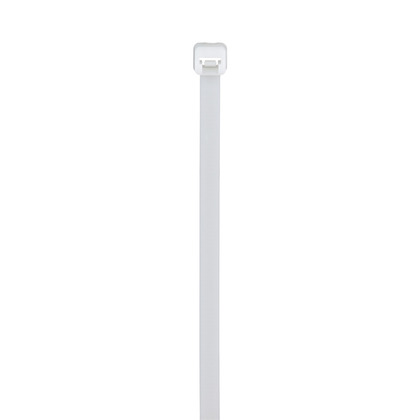</a><figcaption>Product image<a href="https://www.platt.com/p/0013556">Image: Platt ↗</a></figcaption></figure><a class="locate-material" data-material="cable-ties" href="index.html?material=cable-ties#layout" aria-label="View Cable ties in 3D">View in 3D ↑</a> | 6 installed; 6 spare allowance; pack of 100 | **Panduit PLT2S-C · 188 × 4.8 mm** — For small wire bundles and the screw-fixed bases. Keep allowed bend radii and avoid crushing insulation. This length is for cables, not a strap around the meter. | [Buy · Newark](https://www.newark.com/panduit/plt2s-c/cable-tie-nat-188x4-8mm-pk100/dp/24M6057) | Selected: small bundles only. Inspect retained lead bend radii during dry fit. |
| □ To buy | Mounting and bonding hardware<figure class="material-photo" data-image-kind="reference"><figcaption>Machine-screw reference illustration. Nuts, washers and final sizes are selected separately.<a href="https://boltdepot.com/Machine_screws">Image: Bolt Depot ↗</a></figcaption></figure><a class="locate-material" data-material="fasteners" href="index.html?material=fasteners#layout" aria-label="View Mounting and bonding hardware in 3D">View in 3D ↑</a> | Five assembly groups with exact fastener links and counts | **Screw / nut / washer schedule in Build_Package.md** — The package names thread, length, quantity, mating material and engagement. M3 for WAGO; M4 for cable bases; #6-32 for Q0 and XA; #10-32 for the dedicated panel PE bolt. Factory enclosure fasteners are reused. | [Fastener sizes and purchase links](build.html#fasteners) | Specific purchase links provided; receiving checks cover washer thickness and actual stacks. |
| □ To buy | Adjustable logger straps<figure class="material-photo" data-image-kind="product"><a class="material-image" href="assets/materials/logger-straps.png" target="_blank" rel="noopener" aria-label="View full image: Adjustable logger straps">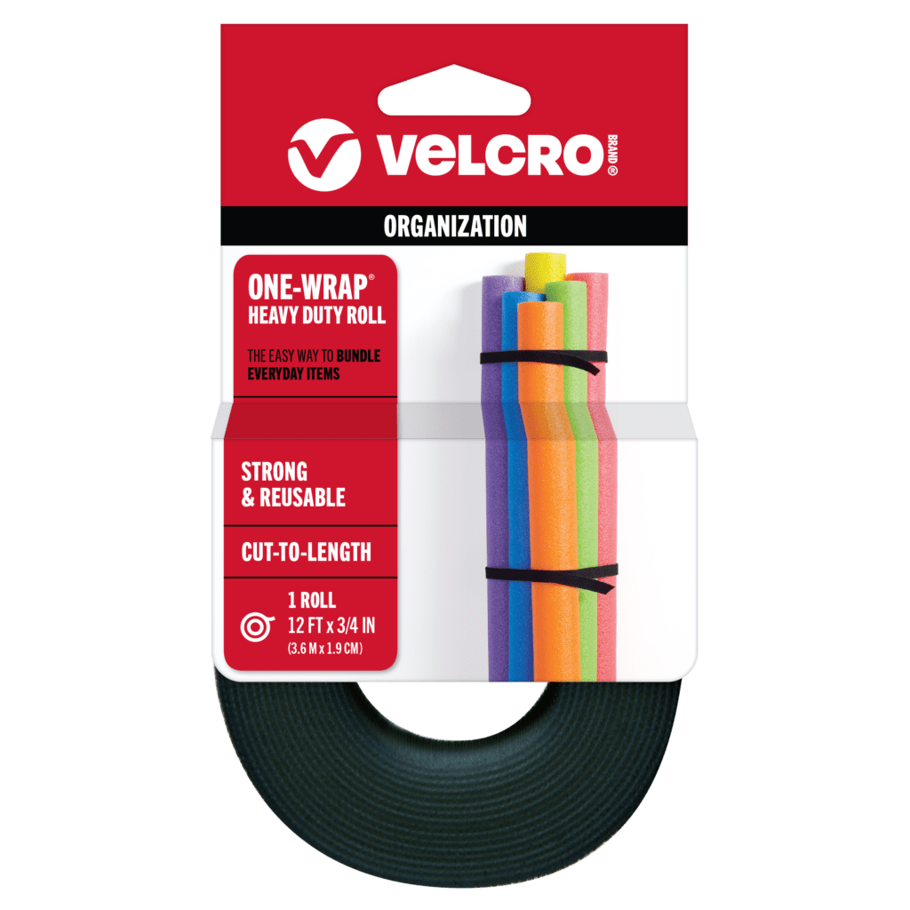</a><figcaption>VELCRO 90340 · 12 ft × 3/4 in roll<a href="https://www.velcro.com/products/organization/heavy-duty-one-wrap-roll/">Image: VELCRO ↗</a></figcaption></figure><a class="locate-material" data-material="logger-restraint" href="index.html?material=logger-restraint#layout" aria-label="View Adjustable logger straps in 3D">View in 3D ↑</a> | 2 × 400 mm blanks; buy one 12 ft roll | **VELCRO ONE-WRAP 90340 · 19.05 mm (3/4 in) wide roll** — Two 21 × 4 mm rounded panel slots per strap, 82 mm apart; flexible retention accommodates the two published logger widths. Feed straps before the panel goes in. Deburr and smooth every slot edge. No rigid custom cradle or housing drilling. | [Buy · Lowe’s 90340](https://www.lowes.com/pd/VELCRO-0-75-in-Black-Strap-Fastener/1087893) [VELCRO product](https://www.velcro.com/products/organization/heavy-duty-one-wrap-roll/) | Four 21 × 4 mm panel slots suit the selected 19.05 mm strap; fit and trim two 400 mm blanks. |

## Software and lab equipment

Arrange access separately from the enclosure purchases. These resources are not marked as owned.

- **ELOG software — Download / install; no separate software purchase.** Use DENT ELOG for configuration, recording and data retrieval. Installation on the lab computer has not been verified. [DENT download](https://www.dentinstruments.com/software-downloads/elog-software-elitepro-xc-sp-power-meters/)
- **ELOG computer and printer under test — Arrange lab equipment.** Need a supported Windows computer with a matching USB port and the printer with its original grounded cord. These are setup resources, not checked as owned or counted as enclosure purchases; no replacement printer or computer has been selected.
- **Assembly and acceptance equipment — Arrange qualified assembly / lab tools.** Calipers, wire stripper, terminal-matched crimper, torque tools, machining/deburring tools, PE/polarity/insulation test equipment and an independent power reference. Arrange access before assembly; tool ratings and procedures belong to the approved build process.

## Build details

The [build package](build.html) contains the machining files, exact fastener sizes and links, wire allowances, assembly order and the outstanding release items. The wall outlet is Leviton 5279-C. Three WAGO groups provide JL, JN and PE; A1 connects directly to JL after Q0. Upstream-only voltage-lead protection remains subject to electrical acceptance. The five owned groups remain unchanged.

The adapter photo confirms CUI SMI6-9-V-P5: 9 V DC, 0.667 A, center positive. The three multicolor pigtails are user-confirmed original DENT kit components, matched to the LD-SKTSP family; the CT matches Mini HSC. One round Tensility extension and one 41380 insert provide the DC entry. No permanent USB entry remains. CT scale and voltage-lead protection/termination remain acceptance items. Purchase status must not be inferred from an ownership tick.

[Installation audit](installation.html) · [Interactive layout and circuit](index.html) · [Dimension schedule](layout_dimensions.json) · [Primary references](references.html)
