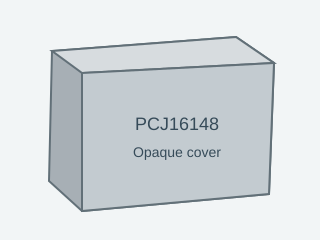
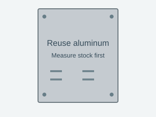
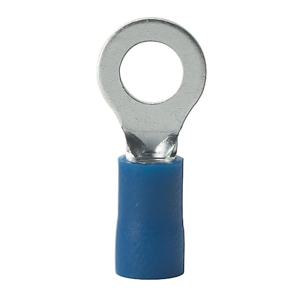
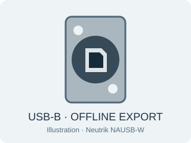
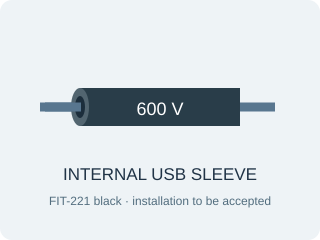

# Materials checklist

September 23, 2026 · revision C · closed-lid offline USB. **✓ 5 confirmed owned groups · ✓ 1 kit supplied · □ 18 to buy + 1 to reuse / fabricate**

One grounded 120 V supply, one printer at a time. Revision C uses an opaque-cover enclosure, proposed reuse of the professor’s aluminum sheet and an internal adapter connection. Five owned equipment groups and the kit USB are retained. The selected 15 A Q0 and upstream-only voltage-lead protection still require application acceptance. No purchase, physical fit, thermal test or electrical release is claimed. Closed-lid USB export is used only after unplugging mains; the permanent internal USB lead requires rated insulation and accepted assembly.

**Inventory basis:** Five equipment groups confirmed by the user: ELITEpro XC, CTs, three user-confirmed original DENT kit pigtails in different colors, matching long leads and original black adapter. DENT specifies an included 1.8 m USB-A to B cable; the photographed kit card places it in the lid pocket. Its present physical location has not been confirmed. Reuse it before buying a replacement.

A check means on hand, not electrically approved. Counts refer to material groups, not individual pieces. Needed quantities and vendor pack sizes differ. The USB cable is **kit supplied**; locate it before purchasing a replacement. Kit inclusion does not confirm its current physical presence.

Buy links go to specific products; Select / Configure links need a size or rating first; Quote / Fabrication links require a supplier quote or a final custom drawing. Check current stock, minimum orders and lead times with each supplier. No orders have been placed.

Photos identify the equipment or candidate part. Family examples and unfinished custom parts are labeled. Images are not at a common scale; use the dimension schedule and 3D layout for size comparisons. Click an image to view the original. Use **View in 3D** to highlight each material’s installation locations. Image sources are credited below each picture.

<h2 id="order-plan">Priced order plan · $287.71 materials</h2>

Checked 2026-09-23. Displayed material prices for the selected design, including purchase packs and fastener spares. Not an order or delivered project quote. Offered panel stock is conditional at $0; machining, bonding changes if required, tools, labor, freight and tax are excluded.

Five selected sellers. Use the listed DigiKey -ND offers; no Marketplace partner offer is selected. Manufacturer factory stock can still ship later or separately. Recheck seller, quantity, delivery and tax in the final cart.

| Seller / exact item | Quantity to enter | Unit price (USD) | Line total (USD) | Availability / packaging |
|---|---|---|---|---|
| Solutions Direct · [PCJ16148](https://www.solutionsdirectonline.com/hammond-16x14x8-polycarbonate-electrical-enclosure-with-solid-cover-pcj16148) | 1 each | $137.11 | $137.11 | Listed for sale; delivery confirmed at checkout |
| Master Electronics · [CA1-B0-24-615-121-DG](https://www.masterelectronics.com/en/productdetail/littelfuse-carling-technologies/ca1b024615121dg-16947583.html) | 1 each | $40.32 | $40.32 | 16 listed in stock; quantity-one tier |
| Home Depot · [515CV](https://www.homedepot.com/p/301304939) | 2 each | $6.99 | $13.98 | One internal XA and one printer output; buy two total |
| DigiKey · [221-415](https://www.digikey.com/en/products/detail/wago-corporation/221-415/13549457) | 3 each | $1.17 | $3.51 | 171,735 listed in stock; 2946-221-415-ND |
| DigiKey · [221-505](https://www.digikey.com/en/products/detail/wago-corporation/221-505/15568477) | 3 each | $2.23 | $6.69 | 2,982 listed in stock; 2946-221-505-ND |
| Home Depot · [55808699 · 14/3 SJOOW](https://www.homedepot.com/p/Southwire-By-the-Foot-14-3-300-Volt-CU-Black-Flexible-Portable-Power-SJOOW-Cord-55808699/204633006) | 13 ft | $1.53 | $19.89 | Minimum 6 ft; order one continuous 13 ft length |
| Home Depot · [515PV-YL](https://www.homedepot.com/p/Leviton-15-Amp-125-Volt-3-Wire-Plug-Yellow-515PV-YL-R10-515PV-0YL/309610976) | 1 each | $3.96 | $3.96 | Store / delivery availability varies |
| DigiKey · [1427NCGPG13LB](https://www.digikey.com/en/products/detail/hammond-manufacturing/1427NCGPG13LB/22152326) | 2 each | $2.97 | $5.94 | Factory stock 1,242; check lead time (not immediate DigiKey stock); 164-1427NCGPG13LB-ND |
| Home Depot · [22955999 · black 14 AWG stranded](https://www.homedepot.com/p/204632031) | 4 ft | $0.42 | $1.68 | One continuous 4 ft length; not a 100 ft roll |
| Home Depot · [22959199 · green 14 AWG stranded](https://www.homedepot.com/p/204632154) | 4 ft | $0.42 | $1.68 | One continuous 4 ft length; not a 100 ft roll |
| Home Depot · [15-104 · 15 terminals](https://www.homedepot.com/p/202522492) | 1 pack (15 pieces per pack) | $3.63 | $3.63 | 15 pieces supplied for a single pack price |
| DigiKey · [TM2S8-C](https://www.digikey.com/en/products/detail/panduit-corp/TM2S8-C/1306625) | 6 each | $0.68 | $4.08 | 14,724 listed in stock; 298-10245-ND; individual pieces |
| DigiKey · [PLT2S-C](https://www.digikey.com/en/products/detail/panduit-corp/PLT2S-C/280043) | 10 each | $0.316 | $3.16 | 113,092 listed in stock; 298-1030-ND; ten-piece price tier |
| Home Depot · [90340 · 12 ft × 3/4 in](https://www.homedepot.com/p/202261925) | 1 roll | $10.77 | $10.77 | One roll supplies four blanks totaling 1.30 m |
| Bolt Depot · [1335 · #6-32 × 3/8 screws](https://boltdepot.com/Product-Details?product=1335) | 4 each | $0.06 | $0.24 | Sold individually; includes stated spares |
| Bolt Depot · [2942 · #6 flat washers](https://boltdepot.com/Product-Details?product=2942) | 4 each | $0.06 | $0.24 | Sold individually; includes stated spares |
| Bolt Depot · [6835 · M3 × 16 screws](https://boltdepot.com/Product-Details?product=6835) | 8 each | $0.06 | $0.48 | Eight total: six carrier sets + two USB flange sets; no M3 spares |
| Bolt Depot · [4513 · M3 washers](https://boltdepot.com/Product-Details?product=4513) | 8 each | $0.05 | $0.40 | Eight total: six carrier sets + two USB flange sets; no M3 spares |
| Bolt Depot · [4792 · M3 locknuts](https://boltdepot.com/Product-Details?product=4792) | 8 each | $0.07 | $0.56 | Eight total: six carrier sets + two USB flange sets; no M3 spares |
| Bolt Depot · [17887 · M4 × 16 screws](https://boltdepot.com/Product-Details?product=17887) | 8 each | $0.09 | $0.72 | Sold individually; includes stated spares |
| Bolt Depot · [4525 · M4 washers](https://boltdepot.com/Product-Details?product=4525) | 8 each | $0.05 | $0.40 | Sold individually; includes stated spares |
| Bolt Depot · [4802 · M4 locknuts](https://boltdepot.com/Product-Details?product=4802) | 8 each | $0.08 | $0.64 | Sold individually; includes stated spares |
| Bolt Depot · [1368 · #10-32 × 3/4 bond screws](https://boltdepot.com/Product-Details?product=1368) | 2 each | $0.19 | $0.38 | Sold individually; proposed PE hardware remains subject to aluminum-bond acceptance |
| Bolt Depot · [2561 · #10-32 nuts](https://boltdepot.com/Product-Details?product=2561) | 4 each | $0.08 | $0.32 | Sold individually; proposed PE hardware remains subject to aluminum-bond acceptance |
| Bolt Depot · [4078 · #10 tooth washers](https://boltdepot.com/Product-Details?product=4078) | 4 each | $0.06 | $0.24 | Sold individually; proposed PE hardware remains subject to aluminum-bond acceptance |
| Bolt Depot · [2946 · #10 flat washers](https://boltdepot.com/Product-Details?product=2946) | 4 each | $0.06 | $0.24 | Sold individually; proposed PE hardware remains subject to aluminum-bond acceptance |
| DigiKey · [NAUSB-W](https://www.digikey.com/en/products/detail/neutrik-americas-inc/NAUSB-W/29371251) | 1 each | $10.68 | $10.68 | 6473-NAUSB-W-ND; 154 listed in stock; quantity one |
| DigiKey · [USB2HAB1](https://www.digikey.com/en/products/detail/startech-com/USB2HAB1/22260595) | 1 each | $6.38 | $6.38 | 5214-USB2HAB1-ND; 1,761 listed in stock; quantity one |
| DigiKey · [F2213/4 BK105](https://www.digikey.com/en/products/detail/alpha-wire/F2213-4-BK105/3718418) | 1 each | $9.39 | $9.39 | F2213/4BK105-ND; 1,182 listed in stock; one 4 ft stick |

| Seller | Materials subtotal (USD) |
|---|---|
| Solutions Direct | $137.11 |
| Master Electronics | $40.32 |
| Home Depot | $55.59 |
| DigiKey | $49.83 |
| Bolt Depot | $4.86 |
| **All selected materials** | **$287.71** |

The two 515CV installation rows below share the **single two-piece order line above**. Do not order two for each location. Aluminum stock and electrical acceptance remain open; see the [receiving record](build.html#receiving-record).

## ✓ Equipment to reuse

| Inventory | Item | Quantity needed | Part and purpose | Purchase / source | Remaining checks |
|---|---|---|---|---|---|
| ✓ Owned | Power logger<figure class="material-photo" data-image-kind="user"><a class="material-image" href="assets/materials/meter.jpg" target="_blank" rel="noopener" aria-label="View full image: Power logger"></a><figcaption>Your equipment · supplied photo</figcaption></figure><a class="locate-material" data-material="meter" href="index.html?material=meter#layout" aria-label="View Power logger in 3D">View in 3D ↑</a> | 1 | **DENT ELITEpro XC** — Reuse the photographed logger. Adjustable straps reserve 216 × 69 × 58 mm, covering both published case envelopes; the visible model retains the current slender 216 × 63 × 47 mm specification. | Reuse · No purchase needed | Owned; confirm actual envelope and connector access before fitting straps. |
| ✓ Owned | Current sensor<figure class="material-photo" data-image-kind="user"><a class="material-image" href="assets/materials/ct.jpg" target="_blank" rel="noopener" aria-label="View full image: Current sensor"></a><figcaption>Your equipment · supplied photo</figcaption></figure><a class="locate-material" data-material="ct" href="index.html?material=ct#layout" aria-label="View Current sensor in 3D">View in 3D ↑</a> | 1 required; existing set available | **DENT Mini HSC · probable CTHSC-050-U/B** — The white hinged case, label layout and partially visible “DENT 50…” match the legacy Mini HSC 50 A / 333.3 mV product. This is a probable variant identification: wires obscure the complete model. DENT 20 A and 50 A Mini HSC versions share the body and 10 mm aperture; both accommodate one printer-hot conductor. Set ELOG from the uncovered label at commissioning, not from appearance. | [DENT Mini HSC specifications](https://www.dentinstruments.com/shop/current-sensors/hinged-current-transformers-sensors-for-energy-metering/) [DENT CT datasheet](https://www.dentinstruments.com/wp-content/uploads/CT-HSC-XXX-U_Datasheet_06132024.pdf) | Owned · Mini HSC family matched; 50 A variant probable, final scale check required. |
| ✓ Owned | DENT voltage pigtails<figure class="material-photo" data-image-kind="user"><a class="material-image" href="assets/materials/blue-leads.jpg" target="_blank" rel="noopener" aria-label="View full image: DENT voltage pigtails"></a><figcaption>Your equipment · one blue example; the three owned pigtails have different colors</figcaption></figure><a class="locate-material" data-material="blue-leads" href="index.html?material=blue-leads#layout" aria-label="View DENT voltage pigtails in 3D">View in 3D ↑</a> | 3 | **DENT LD-SKTSP series · 10 in / 254 mm nominal** — User confirms three original DENT kit pigtails in different colors, all with the same voltage-sensing function. The connector, tinned end and ESIS card match the LD-SKTSP family. A1 feeds L1 hot; A2/A3 feed L2/N neutral. Colors identify connections; these leads do not carry printer load current or serve as PE. | [DENT original product](https://www.dentinstruments.com/shop/elitepro-accessories-replacement-parts/replacement-unterminated-voltage-leads-10-for-elitepro-series/) | Owned · DENT original kit configuration confirmed by user; no replacement planned. Terminal preparation and protection still need acceptance. |
| ✓ Owned | Full voltage leads<figure class="material-photo" data-image-kind="user"><a class="material-image" href="assets/materials/voltage-leads.jpg" target="_blank" rel="noopener" aria-label="View full image: Full voltage leads"></a><figcaption>Your equipment · supplied photo</figcaption></figure><a class="locate-material" data-material="voltage-leads" href="index.html?material=voltage-leads#layout" aria-label="View Full voltage leads in 3D">View in 3D ↑</a> | 1 set; 3 leads used | **Existing matching voltage lead set** — Mate with the three OEM voltage pigtails and retain the full factory leads. Check connector compatibility, insulation and bend allowance. | Reuse · No purchase needed | On hand · confirmed by user; no replacement set planned |
| ✓ Owned | AC/DC adapter<figure class="material-photo" data-image-kind="user"><a class="material-image" href="assets/materials/adapter.jpg" target="_blank" rel="noopener" aria-label="View full image: AC/DC adapter"></a><figcaption>Your equipment · supplied photo</figcaption></figure><a class="locate-material" data-material="adapter" href="index.html?material=adapter#layout" aria-label="View AC/DC adapter in 3D">View in 3D ↑</a> | 1 with original barrel cable | **CUI SMI6-9-V-P5 · existing original adapter** — Reuse the original CUI 9 V / 0.667 A center-positive adapter, with its P5 plug and flat cord intact. It plugs into the internal XA cord connector; its original cable runs directly to the logger. No DC extension, coupling or wall feedthrough. | [CUI original SMI6 datasheet](https://www.belfuse.com/media/datasheets/products/power-supplies/SMI6.pdf) | Owned. Verify full plug seating, restraint, cable slack and temperature during the closed-enclosure pilot. |
| ✓ Kit included | External PC data cable<figure class="material-photo" data-image-kind="reference"><figcaption>Connector reference (StarTech image). Reuse the supplied DENT cable; jacket dimensions are not inferred from this image.<a href="https://www.startech.com/en-us/cables/usb2hab6">Image: StarTech ↗</a></figcaption></figure><a class="locate-material" data-material="usb" href="index.html?material=usb#layout" aria-label="View External PC data cable in 3D">View in 3D ↑</a> | 1 | **DENT kit USB-A to USB-B cable · 1.8 m** — Reuse the kit USB-A to USB-B cable outside the closed enclosure. After printer shutdown, switch Q0 OFF and unplug SUPPLY IN from the wall; connect PC USB-A to the external USB-B service port. The logger is USB-powered for configuration and export. Remove this external cable before reconnecting mains. | [DENT kit contents](https://www.dentinstruments.com/wp-content/uploads/ELITEproXC_Datasheet_01272026.pdf) [DENT USB instructions](https://www.dentinstruments.com/wp-content/uploads/EXC_ELOG19_11-15-24.pdf) | Kit included · locate in the lid pocket; check the computer port and cable condition. Physical presence is not yet confirmed. |

## □ Purchase and fabrication list

| Inventory | Item | Quantity needed | Part and purpose | Purchase / source | Remaining checks |
|---|---|---|---|---|---|
| □ To buy | Enclosure<figure class="material-photo" data-image-kind="design"><figcaption>Opaque-cover concept; base geometry follows the PCJ series. See manufacturer drawing.<a href="https://www.hammfg.com/files/parts/pdf/PCJ16148.pdf">Image: Hammond selection basis ↗</a></figcaption></figure><a class="locate-material" data-material="enclosure" href="index.html?material=enclosure#layout" aria-label="View Enclosure in 3D">View in 3D ↑</a> | 1 | **Hammond PCJ16148 · opaque screw cover** — Same PCJ 16 × 14 × 8 in size class with an opaque gray cover. Supplier list price $137.11 versus $149.45 for the previous clear-cover PCJ16148CC, checked 2026-09-23. X-ray display is a website viewing aid; the purchased lid is opaque. | [Buy · Solutions Direct](https://www.solutionsdirectonline.com/hammond-16x14x8-polycarbonate-electrical-enclosure-with-solid-cover-pcj16148) [Hammond dimensions](https://www.hammfg.com/files/parts/pdf/PCJ16148.pdf) [Hammond standards](https://www.hammfg.com/electrical/products/non-metallic/pcj-sc) | Proposed lower-cost selection. Common base/panel dimensions match the Hammond series drawing; the inherited clear-cover CAD remains a layout template, not a verified solid-cover lid model. **Manufacturer standards:** UL 508A / cUL enclosure types; IEC 60529 IP66, unmodified enclosure only. [Evidence](https://www.hammfg.com/electrical/products/non-metallic/pcj-sc) |
| ◇ Reuse / fabricate | Mounting panel<figure class="material-photo" data-image-kind="design"><figcaption>Fabrication concept; scrap size and thickness remain to be measured.</figcaption></figure><a class="locate-material" data-material="panel" href="index.html?material=panel#layout" aria-label="View Mounting panel in 3D">View in 3D ↑</a> | 1 | **Professor-supplied aluminum · fabricate after measuring** — Use the scrap aluminum offered by Professor Clemon instead of buying 14R1513. Target outline 327.025 × 374.65 mm; modeled thickness 1.89738 mm is a provisional 1.90 mm template, not a measurement of his stock. Confirm thickness, flatness, stiffness and usable area before cutting. Retain a dedicated PE bond using hardware and a method suitable for aluminum. | [Fabrication / stock checks](build.html#panel-stock) [PCJ mounting-panel dimensions](https://www.hammfg.com/files/parts/pdf/PCJ16148.pdf) | Reuse proposed, not received or measured. Verify mounting pattern, bonding, screw stacks and stiffness before fabrication. **Custom mechanical part:** No standalone product certification claimed. Record alloy/thickness and accept aluminum bonding and the complete assembly. [Evidence](build.html#panel-stock) |
| □ To buy | Q0 operating breaker<figure class="material-photo" data-image-kind="reference"><figcaption>C-series reference image from the selected part listing.<a href="https://www.mouser.kr/ProductDetail/Carling-Technologies/CA1-B0-24-615-121-DG?qs=vln4JGBFwFoweMB2W4WfRg%3D%3D">Image: Mouser ↗</a></figcaption></figure><a class="locate-material" data-material="breaker" href="index.html?material=breaker#layout" aria-label="View Q0 operating breaker in 3D">View in 3D ↑</a> | 1 | **Carling CA1-B0-24-615-121-DG** — Single 15 A operating breaker, 50/60 Hz medium-delay, UL489/CSA option DG. Mount directly on the front wall using the manufacturer pattern. No custom wall insert. Keep all four cover screws installed; Q0 OFF leaves its supply terminal live. | [Buy 1 · Master Electronics · $40.32](https://www.masterelectronics.com/en/productdetail/littelfuse-carling-technologies/ca1b024615121dg-16947583.html) [Carling specification](https://www.carlingtech.com/sites/default/files/documents/C-Series_datasheet.pdf) [Carling delay curves](https://www.carlingtech.com/sites/default/files/documents/Carling-HM-CB-Time-Delays.pdf) [Q0 cost and DIN alternative](revision.html#breaker-options) | Retain the user-selected 15 A / UL489 DG configuration. Master Electronics lists one piece at $40.32 and 16 in stock on 2026-09-23. The DIN comparison is complete in revision.html; direct mounting and the existing trip curve are retained. Delivery and price remain checkout-dependent; pre-use application checks are in protection.html. **Manufacturer configuration:** DG option: UL489 / CSA; verify exact ordered suffix. [Evidence](https://www.carlingtech.com/sites/default/files/documents/C-Series_datasheet.pdf) |
| □ To buy | XA adapter receptacle<figure class="material-photo" data-image-kind="product"><figcaption>Product image<a href="https://leviton.com/products/515cv">Image: Leviton ↗</a></figcaption></figure><a class="locate-material" data-material="receptacle" href="index.html?material=receptacle#layout" aria-label="View XA adapter receptacle in 3D">View in 3D ↑</a> | 1 | **Leviton 515CV · internal NEMA 5-15R** — Use a complete cord connector inside the box, matching the printer output connector SKU. A dedicated 14/3 SJOOW branch connects JL/JN/PE to XA upstream of CT. The connector body encloses its terminals and clamps the cord jacket. No wall outlet, custom bracket or wall cutout. | [Buy · Home Depot · 1 of 2 total](https://www.homedepot.com/p/301304939) [Leviton 515CV](https://leviton.com/products/515cv) [Leviton dimensions](https://leviton.com/content/dam/leviton/residential/product_documents/none/Document-31435-Dimensional%20Data.jpg) [Leviton cord instructions](https://leviton.com/content/dam/leviton/residential/product_documents/instruction_sheet/515_Instruction_Sheet.pdf) | Catalog UL498 File E13393 / CSA LR-406. Verify the cord clamp and secure both XA and the adapter on the panel; plugs remain fully seated. **Manufacturer file identified:** UL498 File E13393; CSA C22.2 No.42 File LR-406. [Evidence](https://leviton.com/products/515cv) |
| □ To buy | Distribution connectors<figure class="material-photo" data-image-kind="product"><figcaption>Product image<a href="https://www.digikey.com/en/products/detail/wago-corporation/221-415/13549457">Image: DigiKey ↗</a></figcaption></figure><a class="locate-material" data-material="connectors" href="index.html?material=connectors#layout" aria-label="View Distribution connectors in 3D">View in 3D ↑</a> | 3 | **WAGO 221-415** — One five-port connector each for JL, JN and PE. JL accepts Q0 output, printer hot, A1 and adapter hot; JN accepts supply, printer, A2, A3 and adapter neutrals; PE accepts supply, printer, panel and outlet earth. One accepted conductor per port. Confirm original DENT pigtail preparation and protective-bonding suitability. | [Buy · DigiKey](https://www.digikey.com/en/products/detail/wago-corporation/221-415/13549457) [WAGO](https://www.wago.com/us/wire-splicing-connectors/compact-splicing-connector/p/221-415) | Three mounting positions in the panel drawing. Conductor acceptance is checked at assembly. **Manufacturer certificate table:** WAGO 221-415 datasheet (2024), p.5: cULus Listed UL 486C, E69654; UL 467 grounding, E201573. Confirm supplied part and installation conditions. [Evidence](https://www.netxl.com/wago/docs/221-415-data-sheet.pdf) |
| □ To buy | Connector carriers<figure class="material-photo" data-image-kind="reference"><figcaption>221-505 product image.<a href="https://www.digikey.com/en/products/detail/wago-corporation/221-505/15568477">Image: DigiKey ↗</a></figcaption></figure><a class="locate-material" data-material="carriers" href="index.html?material=carriers#layout" aria-label="View Connector carriers in 3D">View in 3D ↑</a> | 3 | **WAGO 221-505** — Secure each connector to the backpanel with its carrier. Carrier details are schematic; transfer-drill from received parts. Connectors must not rely on wires for support. | [Buy · DigiKey](https://www.digikey.com/en/products/detail/wago-corporation/221-505/15568477) [WAGO](https://www.wago.com/us/wire-splicing-connectors/mounting-carrier-221-series-24-12-awg/p/221-505) [WAGO carrier drawing](https://www1.futureelectronics.com/doc/WAGO/221-505.pdf) | Three carriers, two M3 fixings each; transfer-drill actual front-foot holes. **Mechanical accessory:** Verify mechanical/material suitability; this accessory does not provide mains insulation or confer assembly certification. [Evidence](https://www.wago.com/us/wire-splicing-connectors/mounting-carrier-221-series-24-12-awg/p/221-505) |
| □ To buy | Supply / printer / internal XA cord<figure class="material-photo" data-image-kind="product"><figcaption>Product image<a href="https://www.homedepot.com/p/Southwire-By-the-Foot-14-3-300-Volt-CU-Black-Flexible-Portable-Power-SJOOW-Cord-55808699/204633006">Image: Home Depot ↗</a></figcaption></figure><a class="locate-material" data-material="cord" href="index.html?material=cord#layout" aria-label="View Supply / printer / internal XA cord in 3D">View in 3D ↑</a> | 13 ft (3.962 m): 2.0 m supply + 1.0 m printer + 0.8 m internal XA blanks | **Southwire 55808699 · 14/3 SJOOW** — Use the same 14/3 SJOOW cord for all three runs. XA’s jacket enters its integral cord clamp; branch conductors terminate at JL/JN/PE before CT. Nominal OD approximately 9.17 mm is inside the 515CV 6.22–16.64 mm clamp range. Final route lengths are dry-fit allowances. | [Buy · Home Depot](https://www.homedepot.com/p/Southwire-By-the-Foot-14-3-300-Volt-CU-Black-Flexible-Portable-Power-SJOOW-Cord-55808699/204633006) | Selected length allowance; final ends trimmed only after dry routing. **Manufacturer UL/CSA listed:** Southwire stock 558086: UL 62 and CSA C22.2 No.49; sample jacket marks E46194 / LL90458. Verify actual cord markings and accepted application. [Evidence](https://cabletechsupport.southwire.com/en/tile/1/cable/7386/) |
| □ To buy | Supply plug<figure class="material-photo" data-image-kind="product"><figcaption>Product image<a href="https://leviton.com/products/515pv">Image: Leviton ↗</a></figcaption></figure><a class="locate-material" data-material="supply-plug" href="index.html?material=supply-plug#layout" aria-label="View Supply plug in 3D">View in 3D ↑</a> | 1 | **Leviton 515PV · NEMA 5-15P** — Grounded 15 A / 125 V male supply plug for the 14/3 input cord. Check accepted wire size and jacket OD against the chosen cord. | [Buy plug · Home Depot](https://www.homedepot.com/p/Leviton-15-Amp-125-Volt-3-Wire-Plug-Yellow-515PV-YL-R10-515PV-0YL/309610976) [Leviton cord instructions](https://leviton.com/content/dam/leviton/residential/product_documents/instruction_sheet/515_Instruction_Sheet.pdf) | Published 6.22–16.64 mm cord range includes the selected nominal 9.2 mm cord; verify clamping on receipt. **Manufacturer file identified:** UL498 File E13393; CSA C22.2 No.42 File LR-406. [Evidence](https://leviton.com/products/515pv) |
| □ To buy | Printer output connector<figure class="material-photo" data-image-kind="product"><figcaption>Product image<a href="https://leviton.com/products/515cv">Image: Leviton ↗</a></figcaption></figure><a class="locate-material" data-material="printer-connector" href="index.html?material=printer-connector#layout" aria-label="View Printer output connector in 3D">View in 3D ↑</a> | 1 | **Leviton 515CV · NEMA 5-15R** — Grounded female cord connector for the measured printer output. The printer connects here; XA is reserved for the meter adapter. Buy two 515CV connectors total: one here and one for internal XA; do not order two per row. | [Buy · Home Depot · 1 of 2 total](https://www.homedepot.com/p/301304939) [Leviton cord instructions](https://leviton.com/content/dam/leviton/residential/product_documents/instruction_sheet/515_Instruction_Sheet.pdf) | Published 6.22–16.64 mm cord range includes the selected nominal 9.2 mm cord; verify clamping on receipt. **Manufacturer file identified:** UL498 File E13393; CSA C22.2 No.42 File LR-406. [Evidence](https://leviton.com/products/515cv) |
| □ To buy | Mains / printer strain relief<figure class="material-photo" data-image-kind="product"><figcaption>Hammond 1427NCGPG13LB long-thread gland<a href="https://www.hammfg.com/part/1427NCGPG13LB">Image: Hammond ↗</a></figcaption></figure><a class="locate-material" data-material="cord-glands" href="index.html?material=cord-glands#layout" aria-label="View Mains / printer strain relief in 3D">View in 3D ↑</a> | 2 | **Hammond 1427NCGPG13LB · long PG13.5 thread** — Two long-thread glands for the selected 14/3 SJOOW mains cords. 6–12 mm clamp range covers the published ~9.2 mm cord OD. The 15 mm thread replaces the former short-thread candidate. Includes nylon locknut and EPDM O-ring. | [Buy · DigiKey](https://www.digikey.com/en/products/detail/hammond-manufacturing/1427NCGPG13LB/22152326) [Hammond dimensions](https://www.hammfg.com/part/1427NCGPG13LB) | 15 mm long thread selected for the ~4.8 mm wall; verify full locknut engagement on receipt. **Manufacturer UL Listed:** Hammond lists the 1427NCG family, including 1427NCGPG13LB, as UL Listed with IP68 protection. Verify installed sealing and clamp; the modified assembly is not certified by this component listing. [Evidence](https://www.hammfg.com/electronics/small-case/accessories/1427ncg) |
| □ To buy | Internal L / N / PE wire<figure class="material-photo" data-image-kind="reference"><figcaption>Southwire 14 AWG stranded THHN family reference<a href="https://www.southwire.com/wire-cable/building-wire/thhn-thwn-copper-silicone-free/p/22955984">Image: Southwire ↗</a></figcaption></figure><a class="locate-material" data-material="internal-wire" href="index.html?material=internal-wire#layout" aria-label="View Internal L / N / PE wire in 3D">View in 3D ↑</a> | Buy 4 ft black + 4 ft green (1.2192 m of each); use suitable lab stock first. | **Southwire 14 AWG, 19-strand Class C, THHN/THWN/MTW, 600 V** — Separate 14 AWG conductors remain for Q0 OUT → JL and PE → panel. XA hot, neutral and PE are the conductors of its 14/3 cord; no separate white roll is required. Reuse suitable labeled lab stock first. | [Black 22955999 · buy 4 ft · $1.68](https://www.homedepot.com/p/204632031) [Green 22959199 · buy 4 ft · $1.68](https://www.homedepot.com/p/204632154) [Southwire construction](https://www.southwire.com/wire-cable/building-wire/thhn-thwn-copper-silicone-free/p/22955984) | Same 14 AWG stranded construction, sold by the foot; 4 ft of each color exceeds the 1 m cutting allowance. Confirm the received wire markings and crimp fit. **Manufacturer UL/cUL product:** THHN/THWN/MTW listing and accepted wiring method; verify actual marked stock. [Evidence](https://www.southwire.com/wire-cable/building-wire/thhn-thwn-copper-silicone-free/p/22955984) |
| □ To buy | Ring terminals<figure class="material-photo" data-image-kind="product"><figcaption>Selected 15-104 product; 15-pack<a href="https://www.homedepot.com/p/202522492">Image: Home Depot / Gardner Bender ↗</a></figcaption></figure><a class="locate-material" data-material="ring-lugs" href="index.html?material=ring-lugs#layout" aria-label="View Ring terminals in 3D">View in 3D ↑</a> | 1 pack of 15; 3 installed, 12 available as spares | **Gardner Bender 15-104 · #8–10 stud, 16–14 AWG** — The #8–10 stud range includes the Q0 #10-32 studs. This UL/CSA-listed 15-pack replaces the $105.36 100-piece bottle with a $3.63 purchase. Use only on 14–16 AWG conductors; the aluminum-panel bond still requires an accepted contact method. | [Buy 1 pack of 15 · Home Depot · $3.63](https://www.homedepot.com/p/202522492) [Gardner Bender approvals and dimensions](https://www.gardnerbender.com/en/p/15-104/-16-14-AWG-2-mm-sq-Bnes-%C3%A0-anneau) | Manufacturer: UL listed, CSA listed, 600 V building wire, 75°C. Use the specified insulated-terminal crimp tooling; inspect wire insertion, insulation fit and pull retention. No unpublished barrel diameter or crimp setting is assumed. **Manufacturer UL Listed / CSA Listed:** Exact 15-104 product: 16–14 AWG, #8–10 studs, 600 V for building wire, 75°C. This certifies the terminal product, not the crimp workmanship or the custom panel bond. [Evidence](https://www.gardnerbender.com/en/p/15-104/-16-14-AWG-2-mm-sq-Bnes-%C3%A0-anneau) |
| □ To buy | Screw-fixed cable mounts<figure class="material-photo" data-image-kind="product"><figcaption>Product image<a href="https://www.biscoind.com/en-US/panduit-cable-ties-and-accessories-tm2s8-c/p">Image: bisco industries ↗</a></figcaption></figure><a class="locate-material" data-material="tie-mounts" href="index.html?material=tie-mounts#layout" aria-label="View Screw-fixed cable mounts in 3D">View in 3D ↑</a> | Buy 6 individual pieces; all 6 installed | **Panduit TM2S8-C** — Six screw-fixed bases retain the mains bundle, XA branch conductors, CT pair, both sides of the voltage-lead coils, and the original internal DC cable and sleeved USB lead. DigiKey lists individual pieces, avoiding the previous 100-piece purchase. | [Buy individually · DigiKey](https://www.digikey.com/en/products/detail/panduit-corp/TM2S8-C/1306625) | Six panel locations; M4 × 16 mm screws, underside washers and locknuts in the fastener schedule. **Mechanical accessory:** Verify mechanical/material suitability; this accessory does not provide mains insulation or confer assembly certification. [Evidence](https://www.digikey.com/en/products/detail/panduit-corp/TM2S8-C/1306625) |
| □ To buy | Cable ties<figure class="material-photo" data-image-kind="product"><figcaption>Product image<a href="https://www.platt.com/p/0013556">Image: Platt ↗</a></figcaption></figure><a class="locate-material" data-material="cable-ties" href="index.html?material=cable-ties#layout" aria-label="View Cable ties in 3D">View in 3D ↑</a> | Buy 10 individual ties; 6 installed + 4 spares | **Panduit PLT2S-C · 188 × 4.8 mm** — For small wire bundles and the screw-fixed bases. Keep allowed bend radii and avoid crushing insulation. This length is for cables, not a strap around the meter. | [Buy 10 individual ties · DigiKey · $3.16](https://www.digikey.com/en/products/detail/panduit-corp/PLT2S-C/280043) | DigiKey lists individual ties: ten cost $3.16 at the 10-piece tier. No 100-piece pack required. Check actual bundle retention and bend radii. **Mechanical accessory:** Verify mechanical/material suitability; this accessory does not provide mains insulation or confer assembly certification. [Evidence](https://www.digikey.com/en/products/detail/panduit-corp/PLT2S-C/280043) |
| □ To buy | Mounting and bonding hardware<figure class="material-photo" data-image-kind="reference"><figcaption>Machine-screw reference illustration. Nuts, washers and final sizes are selected separately.<a href="https://boltdepot.com/Machine_screws">Image: Bolt Depot ↗</a></figcaption></figure><a class="locate-material" data-material="fasteners" href="index.html?material=fasteners#layout" aria-label="View Mounting and bonding hardware in 3D">View in 3D ↑</a> | Five assembly groups; check suitable lab stock first | **Screw / nut / washer schedule in Build_Package.md** — Q0, three WAGO carriers, six cable mounts and the dedicated aluminum-panel PE bond. XA no longer needs flange screws. Thread, length and actual stack checks are in the build package; aluminum bonding method must be accepted. Two M3 sets previously allowed as spares now mount the USB port, keeping the eight-set order unchanged. | [Fastener sizes and purchase links](build.html#fasteners) | Eight M3 sets total: six carriers + two USB. Check actual stacks; panel bonding remains conditional. **Mechanical accessory:** Verify mechanical/material suitability; this accessory does not provide mains insulation or confer assembly certification. [Evidence](build.html#fasteners) |
| □ To buy | Adjustable equipment straps<figure class="material-photo" data-image-kind="product"><figcaption>VELCRO 90340 · 12 ft × 3/4 in roll<a href="https://www.velcro.com/products/organization/heavy-duty-one-wrap-roll/">Image: VELCRO ↗</a></figcaption></figure><a class="locate-material" data-material="logger-restraint" href="index.html?material=logger-restraint#layout" aria-label="View Adjustable equipment straps in 3D">View in 3D ↑</a> | 2 × 400 mm logger blanks + 2 × 250 mm XA/adapter blanks; one 12 ft roll | **VELCRO ONE-WRAP 90340 · 19.05 mm (3/4 in) wide roll** — Two straps retain the logger; one retains XA and one retains the adapter. Use eight smooth 21 × 4 mm slots, with each pair oriented to the illustrated strap. Fit, trim and verify retention without covering labels or overheating the adapter. No drilling into the equipment. | [Buy · Home Depot 90340](https://www.homedepot.com/p/202261925) [VELCRO product](https://www.velcro.com/products/organization/heavy-duty-one-wrap-roll/) | Four straps proposed; actual fit, plug retention and temperature remain physical checks. **Mechanical accessory:** Verify mechanical/material suitability; this accessory does not provide mains insulation or confer assembly certification. [Evidence](https://www.velcro.com/products/organization/heavy-duty-one-wrap-roll/) |
| □ To buy | Closed-lid USB service port<figure class="material-photo" data-image-kind="design"><figcaption>Design illustration; use the linked manufacturer specification.<a href="https://www.neutrik.com/en/product/nausb-w">Image: Manufacturer specification ↗</a></figcaption></figure><a class="locate-material" data-material="usb-port" href="index.html?material=usb-port#layout" aria-label="View Closed-lid USB service port in 3D">View in 3D ↑</a> | 1 | **Neutrik NAUSB-W · USB-B outside / USB-A inside** — Reversible USB 2.0 A/B feedthrough keeps the lid closed for offline export. Set the insert to B outside and A inside. One Ø24 mm project bore and two Ø3.2 mm project clearance holes follow the manufacturer D pattern; verify fit on received parts. | [Buy · DigiKey](https://www.digikey.com/en/products/detail/neutrik-americas-inc/NAUSB-W/29371251) [Neutrik specification](https://www.neutrik.com/en/product/nausb-w) [Neutrik drawing](https://www.neutrik.com/media/8974/download/nausb-w-2.pdf?v=1) | Selected; check insert orientation, flange fastening, sleeve/end coverage and shield treatment. Dry indoor use; ordinary kit cable does not satisfy Neutrik’s special mated IP65 conditions. **USB standard / material evidence:** USB 2.0 specification; UL94 V-0 insert material. These are not a UL Listed product or a certified mains isolation barrier. [Evidence](https://www.neutrik.com/en/product/nausb-w) |
| □ To buy | Short internal USB lead<figure class="material-photo" data-image-kind="reference"><figcaption>USB-A/B connector reference; selected internal cable is USB2HAB1, 1 ft.<a href="https://media.startech.com/cms/pdfs/usb2hab1_datasheet.pdf">Image: StarTech ↗</a></figcaption></figure><a class="locate-material" data-material="usb-internal" href="index.html?material=usb-internal#layout" aria-label="View Short internal USB lead in 3D">View in 3D ↑</a> | 1 | **StarTech USB2HAB1 · 1 ft / 304.8 mm · A male to B male** — USB-B plugs into DENT; USB-A plugs into the service port inside. Short cable reduces stored slack. It stays installed during printing and must be covered by the selected rated sleeve; a USB 2.0 claim alone is not a mains insulation rating. | [Buy · DigiKey](https://www.digikey.com/en/products/detail/startech-com/USB2HAB1/22260595) [StarTech datasheet](https://media.startech.com/cms/pdfs/usb2hab1_datasheet.pdf) | Selected; dry-fit actual connector molds, usable flexible length, bends and retention. No standalone mains-voltage rating is claimed. **Data interface specification:** USB 2.0 A-to-B cable; not accepted as mains insulation. Additional rated sleeve and qualified installation are required. [Evidence](https://media.startech.com/cms/pdfs/usb2hab1_datasheet.pdf) |
| □ To buy | Internal USB insulation sleeve<figure class="material-photo" data-image-kind="design"><figcaption>Design illustration; use the linked manufacturer specification.<a href="https://www.alphawire.com/products/accessories/fit-heat-shrink-tubing/shrink-tubing/fit2213_4">Image: Manufacturer specification ↗</a></figcaption></figure><a class="locate-material" data-material="usb-sleeve" href="index.html?material=usb-sleeve#layout" aria-label="View Internal USB insulation sleeve in 3D">View in 3D ↑</a> | 1 × 4 ft stick; cut to accepted coverage | **Alpha Wire F2213/4 BK105 · black FIT-221, 600 V** — Provides the additional rated insulation required by DENT for USB cable inside an electrical enclosure. Minimum supplied ID 19.05 mm; recovered ID up to 9.53 mm. Cover the full internal cable and protect its terminations; keep clear of mains and secure against sliding. The model shows an illustrative sleeve envelope. | [Buy · DigiKey](https://www.digikey.com/en/products/detail/alpha-wire/F2213-4-BK105/3718418) [Alpha Wire 600 V specification](https://www.alphawire.com/products/accessories/fit-heat-shrink-tubing/shrink-tubing/fit2213_4) | Assembly acceptance required: measure connector passage, full coverage and end retention. Approve the recovery process for the cable/connector materials; do not infer heat-application safety from continuous operating ratings. **Manufacturer UL / CSA specification:** Black FIT-221: UL224 and CSA198, 600 V. Material qualification does not validate this installed sleeve or provide USB galvanic isolation. [Evidence](https://www.alphawire.com/products/accessories/fit-heat-shrink-tubing/shrink-tubing/fit2213_4) |

## Software and lab equipment

Arrange access separately from the enclosure purchases. These resources are not marked as owned.

- **ELOG software — Download / install; no separate software purchase.** Use DENT ELOG for configuration, recording and data retrieval. Installation on the lab computer has not been verified. [DENT download](https://www.dentinstruments.com/software-downloads/elog-software-elitepro-xc-sp-power-meters/)
- **ELOG computer and printer under test — Arrange lab equipment.** Need a supported Windows computer with a matching USB port and the printer with its original grounded cord. These are setup resources, not checked as owned or counted as enclosure purchases; no replacement printer or computer has been selected.
- **Assembly and acceptance equipment — Arrange qualified assembly / lab tools.** Calipers, wire stripper, terminal-matched crimper, torque tools, machining/deburring tools, PE/polarity/insulation test equipment and an independent power reference. Arrange access before assembly; tool ratings and procedures belong to the approved build process.

## Build details

The [build package](build.html) contains the machining files, exact fastener sizes and links, wire allowances, assembly order and the outstanding release items. Internal XA uses Leviton 515CV, the same SKU as the printer output. The original adapter and cable remain inside; no XA or DC wall opening. Three WAGO groups provide JL, JN and PE; A1 connects directly to JL after Q0. Upstream-only voltage-lead protection remains subject to electrical acceptance. The five owned groups remain unchanged.

The adapter photo confirms CUI SMI6-9-V-P5: 9 V DC, 0.667 A, center positive. The three multicolor pigtails are user-confirmed original DENT kit components, matched to the LD-SKTSP family; the CT matches Mini HSC. The original DC cable connects directly to the logger; no extension or DC entry is purchased. One right-wall USB service port supports closed-lid offline export; the permanent internal cable requires the selected 600 V sleeve. CT scale and voltage-lead protection/termination remain acceptance items. Purchase status must not be inferred from an ownership tick.

[Installation audit](installation.html) · [Interactive layout and circuit](index.html) · [Dimension schedule](layout_dimensions.json) · [Primary references](references.html)
